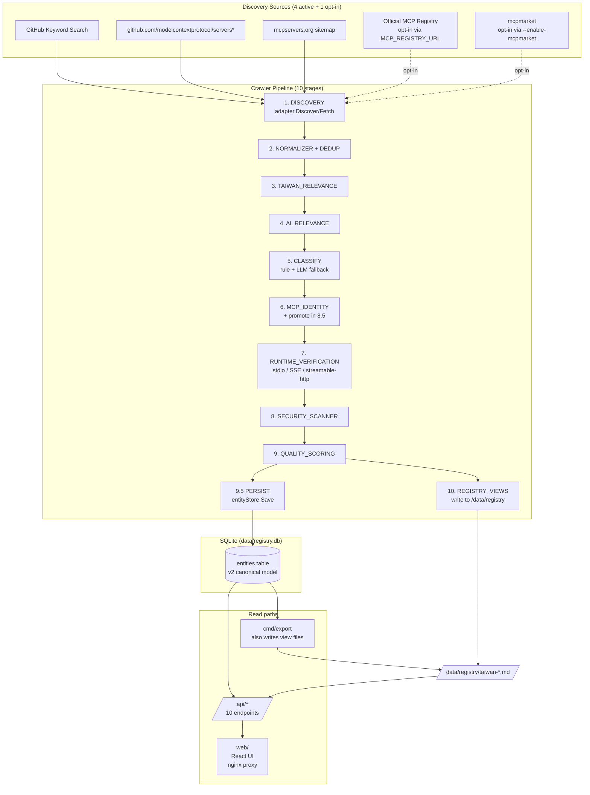

<div align="center">

[English](README.md) | [繁體中文](README.zh-TW.md) | [简体中文](README.zh-CN.md)

</div>

# Taiwan AI Ecosystem Registry

Automated crawler and registry builder for discovering, classifying, and verifying Taiwan-related AI tools, MCP servers, datasets, and infrastructure.

## Overview

The **Taiwan AI Ecosystem Registry** crawls multiple sources (GitHub, mcpservers.org, the official MCP registry) to discover AI-related entities — including MCP servers, AI agents, datasets, SDKs, and infrastructure — that have Taiwan relevance. Each entity goes through a 10-stage pipeline (Discovery → Normalize → Taiwan/AI relevance → Classify → MCP Identity → Runtime Verify → Security Scan → Quality Score → Persist → Export) and the resulting registry is served through a REST API and a React web UI.

The system is intentionally broader than MCP: MCP is one of ~20 supported `PrimaryClassification` values (others include `AI_AGENT`, `AI_TOOL`, `AI_DATASET`, `AI_TUTORIAL`, `MCP_COLLECTION`, `DATA_LIBRARY`, and more). Spec section 60 / 63:

```text
DISCOVER BROADLY → CLASSIFY EXPLICITLY → VERIFY OBJECTIVELY → PUBLISH CONSERVATIVELY
```

`"MCP mentioned"` ≠ `"MCP used"` ≠ `"MCP client"` ≠ `"MCP server"` ≠ `"Verified MCP server"`. Each is a separate state in the data model.

## Features

- **Multi-source discovery** — 4 active sources (`github`, `github-repo:modelcontextprotocol/servers*`, `registry` [opt-in], `mcpserversorg`); `mcpmarket` is opt-in because of upstream Vercel WAF (T105)
- **Two-tier GitHub keyword strategy** — 25 Taiwan+AI broad queries by default; `--include-mcp-anchored` adds 7 MCP-anchored queries (T101)
- **Retry-aware HTTP** — all sources wrap their HTTP client in `internal/retry.RetryableClient` with exponential backoff (mcpserversorg: 3s base, 2 concurrent)
- **5 MCP identity states** — `CANDIDATE → STATIC_VERIFIED → RUNTIME_VERIFIED → VERIFIED` with a separate `NOT_MCP` terminal state (T102)
- **SSE and streamable-http runtime handshake** — T100 implements the real MCP initialize + tools/list round-trip; stdio via subprocess
- **Data Library guard** — Priority -0.5 rule that prevents `twmarketdata`/`tw-quant-db`-style projects from being mis-promoted to `MCP_SERVER` (T111, spec §22/§23/§48)
- **Per-evidence classification evidence** with `Source`/`File`/`Snippet` fields (T109)
- **Spec §27 evidence weighting** + three hard-rule helpers (T110)
- **LLM fallback** — `--enable-llm-classifier` (default on) attaches an LLM classifier when `OPENAI_API_KEY` is set; rule + LLM confidence both flow through (T108)
- **REST API** — 10 endpoints (see [API](#api-reference))
- **Web UI** — Dashboard with statistics + markdown view render; Server list with classification badges
- **Seed tool** — `cmd/seed` populates the v2 entities table from `registry/registry.json` for local development without running the full crawler

## Architecture



### Key modules

| Path | Purpose |
|---|---|
| `cmd/crawler` | CLI: discover, classify, verify, scan, score, migrate, export, run |
| `cmd/api` | REST server (port 8003) |
| `cmd/export` | Standalone view generator from DB |
| `cmd/migrate` | V1 → V2 schema migration (DB has no v1 table to migrate from in dev) |
| `cmd/seed` | One-shot seed: `registry/registry.json` → v2 entities |
| `internal/coordinator` | 10-stage pipeline orchestrator |
| `internal/engines` | Rule-based + LLM classifier, MCP identity, runtime verifier, quality engine, security scanner, endpoint classifier |
| `internal/sources/{github,githubrepo,registry,mcpserversorg,mcpmarket}` | One adapter per external source |
| `internal/storage` | SQLite v2 store (`entities` table) |
| `internal/export` | View generator (10 `taiwan-*.md` + `.json` files) |
| `internal/api` | REST handlers |
| `web/` | React 19 + Vite + nginx |

## Requirements

- **Go 1.25+** (module declares `go 1.25.0`; tested with 1.27)
- **Node 20+** and **pnpm 9+** for the web UI
- **Docker** with BuildKit (the web build is multi-stage)
- **`GITHUB_TOKEN`** recommended for higher GitHub search rate limits (60/h anonymous → 5000/h with token)
- **`OPENAI_API_KEY`** optional; enables LLM classification fallback for ambiguous entities
- **Disk**: ~2 GB for the `ai-ecosystem-*` Docker images, ~50 MB for `data/registry.db` and the `registry/` view output

## Installation

```bash
# Clone
git clone <repository-url> awesome-taiwan-ai-ecosystem
cd awesome-taiwan-ai-ecosystem

# Build all Go binaries into bin/
make build
# produces bin/crawler bin/api bin/exporter bin/migrator

# Install web dependencies
cd web && pnpm install && pnpm build && cd ..
```

Or build everything via Docker:

```bash
docker compose build
```

## Configuration

All variables are read from the environment. The crawler container in `docker-compose.yaml` exposes these with empty defaults so a plain `docker compose up` works against anonymous GitHub and disabled registry/mcpmarket sources.

| Variable | Default | Used by | Notes |
|---|---|---|---|
| `GITHUB_TOKEN` | empty | `crawler`, `api` | Higher rate limit when set |
| `OPENAI_API_KEY` | empty | `crawler` | Enables LLM classification fallback |
| `OPENAI_BASE_URL` | `https://opencode.ai/zen/v1` | `crawler` | OpenAI-compatible chat completions URL |
| `OPENAI_MODEL` | empty (crawler picks first from env) | `crawler` | Single model name; default fallback chain is `gpt-4o-mini → gpt-4o` |
| `MCP_REGISTRY_URL` | empty (source disabled) | `crawler` | Real official MCP registry URL; source is opt-in to avoid hitting the placeholder `api.mcp-servers.dev` |
| `VITE_API_URL` | `http://api:8003/api/v1` | `web` build | Injected at build time |

CLI flags of interest on the crawler (full list via `crawler --help`):

| Flag | Default | Effect |
|---|---|---|
| `--db` | `./data/registry.db` | SQLite path |
| `--source` | `all` | `github` / `registry` / `mcpserversorg` / `mcpmarket` / `all` |
| `--pipeline` | `full` | `full` / `discovery-only` / `classify-only` / `verify-only` |
| `--include-mcp-anchored` | `false` | Adds 7 MCP-anchored queries to the GitHub search |
| `--enable-mcpmarket` | `false` | Opt-in to mcpmarket (Vercel WAF upstream) |
| `--enable-llm-classifier` | `true` | Off = pure rule-based classification |
| `--workers` | `4` | Concurrency per source |
| `--malicious-threshold` | `MEDIUM` | `LOW` / `MEDIUM` / `HIGH` / `CRITICAL` |

## Quick Start

The fastest path to a populated registry on a fresh clone:

```bash
# 1. Seed 561 legacy records into the v2 entities table.
#    This skips the long crawler run and lets you exercise the
#    API + view generator immediately.
go run ./cmd/seed --db data/registry.db --limit 561

# 2. Generate view files into ./registry/
go run ./cmd/seed --db data/registry.db --limit 561   # idempotent
docker compose run --rm crawler export --db /data/db/registry.db

# 3. Build and start the API + web
docker compose build
docker compose up -d api web
# 4. Open
open http://localhost:3000      # web UI
curl http://localhost:3000/api/v1/health   # 200, db_count: 561
```

To run the full crawler instead of the seed (slower, real network):

```bash
docker compose up -d crawler   # runs the 10-stage pipeline; logs to docker logs
```

A complete crawl against the 4 active sources typically takes 30-60+ minutes because of the per-source backoff (mcpserversorg has 1455 candidates after the slug filter, each fetched serially through the retry client).

## API Reference

All endpoints are GET unless noted. The web UI proxies `/api/*` to the api container via nginx.

| Endpoint | Description | Returns |
|---|---|---|
| `GET /health` | Liveness | `{status, timestamp, version, db_count}` |
| `GET /api/v1` | API index | Endpoints list |
| `GET /api/v1/health` | Same as `/health` | (duplicate path for v1 namespace) |
| `GET /api/v1/entities` | Entity list (v2 canonical) | `{entities: [...], pagination: {...}}` — defaults to `MinTaiwanLevel=T1`, pass `?all=true` to see all 561 |
| `GET /api/v1/entities?level=T3` | Filter by Taiwan level | Same shape, filtered |
| `GET /api/v1/entities?category=AI_AGENT` | Filter by primary classification | Same shape, filtered |
| `GET /api/v1/servers` | Legacy MCP_SERVER view (back-compat) | `{servers: [...], pagination: {...}}` — only entities with `MCP_SERVER` + `RuntimeVerified` (currently empty in dev) |
| `GET /api/v1/servers/{id}` | Single server by ID | `{server: ...}` |
| `GET /api/v1/search` | Full-text search | `{query, results: [...], pagination: {...}}` |
| `GET /api/v1/registry` | Full registry v0.1 shape (back-compat) | `{schema_version, statistics, servers: [...]}` |
| `GET /api/v1/registry/markdown` | List available view files | `{files: ["taiwan-ai-ecosystem.md", ...]}` |
| `GET /api/v1/registry/markdown?file=taiwan-ai-ecosystem.md` | One view file | Raw `text/markdown` body |
| `GET /api/v1/registry/index` | Cross-file summary (the dashboard's index table) | `{total_entities, view_count, views: [{slug, name, description, group, count, filename}]}` |
| `GET /api/v1/statistics` | Counts by level / health / quality / status / classification | `{total_servers, taiwan_relevant, by_level, by_health, quality_distribution, by_status, by_classification}` — T1+ filtered |

### Pagination

`page` (default `1`) and `limit` (default `50`, max `1000`) query params on the list endpoints.

## Data Model

The v2 entity (`internal/models/entity.go`, `Entity` struct) carries the canonical schema (spec §37):

```yaml
id: string                       # sha256 hex of canonical identity
name, slug, description: string
classification:
  primary: PrimaryClassification # MCP_SERVER / AI_AGENT / AI_TOOL / AI_DATASET / ...
  secondary: []string
  confidence: 0-100
taiwan_relevance: { score, level (T0..T5), evidence, confidence }
ai_relevance: { score, level, evidence, confidence }
mcp_identity:
  related: bool
  status: CANDIDATE | STATIC_VERIFIED | RUNTIME_VERIFIED | VERIFIED | NOT_MCP
  role: SERVER | CLIENT | HOST | SDK | LIBRARY | ...
  confidence: 0-100
  static_checked_at, runtime_verified_at: timestamp
endpoints: [{ url, transport, type, verified }]  # type per spec §24
repository: { url, owner, name, stars, language, topics, ... }
quality: { score, grade (A-F), components (10), evidence }
security: { status (CLEAN/SUSPICIOUS/QUARANTINED/BLOCKED), findings }
sources: [{ primary, source, url, trust_score }]   # primary flag added in T104
entity_status: DISCOVERED | CLASSIFIED | VERIFIED | REJECTED | QUARANTINED
```

JSON schema for the entity and the registry wrapper lives in `schema/entity.json` and `schema/registry.json` (T106, v2.0).

## Data Sources

| Source | Trust | Status | Notes |
|---|---|---|---|
| `github` | 0.95 | active | Two keyword tiers (T101): 25 broad + 7 MCP-anchored (opt-in) |
| `github-repo:modelcontextprotocol/servers` | 0.95 | active | Pulls the canonical MCP servers list |
| `github-repo:modelcontextprotocol/servers-archived` | 0.95 | active | Pulls archived entries |
| `mcpserversorg` | 0.7 | active | Slug pre-filter (T107) cuts 10182 → 1455 candidates |
| `registry` | 0.9 | **opt-in** (T103) | Was hard-coded to `https://api.mcp-servers.dev` (DNS fails). Set `MCP_REGISTRY_URL` to enable |
| `mcpmarket` | 0.7 | **opt-in** (T105) | Behind Vercel WAF; default disabled, use `--enable-mcpmarket` |

## Configuration Files

| File | Purpose |
|---|---|
| `config/pipeline.yaml` | Pipeline configuration (mode, timeouts, filters) — currently informational; the Go code reads CLI flags |
| `config/sources.yaml` | Source list (placeholder; Go code uses the hard-coded source list in `cmd/crawler/main.go`) |
| `config/taiwan_signals.yaml` | Keyword dictionary for Taiwan relevance |
| `config/ai_signals.yaml` | Keyword dictionary for AI relevance |
| `config/categories.yaml` | Category enum |
| `config/domains.yaml` | Taiwan official domain list |

## Output: Registry Views

The view generator (`internal/export/view_generator.go`) writes 10 markdown + 10 JSON files to `/data/registry/`. Each is a different filter over the entity set (see spec §44 / §60).

| File | Filter | Seed dataset count (561 records) |
|---|---|---|
| `taiwan-ai-ecosystem.md` | T1+ Taiwan relevant, all primary classifications | 200 |
| `taiwan-mcp.md` | `MCP_SERVER` + `MCP_VERIFIED` + T1+ + not blocked | 0 (no entity reaches VERIFIED in the seed path) |
| `taiwan-mcp-candidates.md` | `MCP_SERVER` + `STATIC_VERIFIED` or `CANDIDATE` | 415 |
| `taiwan-ai-agents.md` | `AI_AGENT` | 16 |
| `taiwan-ai-tools.md` | `AI_TOOL` / `AI_SDK` / `AI_FRAMEWORK` / `AI_PLUGIN` | 5 |
| `taiwan-ai-data.md` | `AI_DATASET` / `DATA_LIBRARY` / `AI_KNOWLEDGE_BASE` | 12 |
| `taiwan-ai-skills.md` | `MCP_SKILL` / `AI_SKILL` | 0 |
| `taiwan-ai-infrastructure.md` | `AI_INFRASTRUCTURE` | 0 |
| `taiwan-ai-tutorials.md` | `AI_TUTORIAL` / `AI_EXAMPLE` / `TUTORIAL` | 7 |
| `taiwan-ai-collections.md` | `MCP_COLLECTION` / `AI_COLLECTION` / `COLLECTION` | 19 |
| `awesome-taiwan-mcp.md` | Legacy back-compat view (MCP only) | varies |
| `malicious/MALICIOUS_REPORT.md` + `blocklist.txt` | Security scan output | generated on every export |
| `security/injection/INJECTION_REPORT.md` + `patterns.json` | Prompt-injection scan output | generated on every export |

The counts above are from one seed run (561 legacy records); re-running the seed with `--limit 0` and re-running the full crawler will produce different numbers. Live counts are available at any time via `GET /api/v1/registry/index` (the Dashboard renders this as a navigable index table).

## Error Handling

- **Crawler** stages log per-entity failures (e.g. `fetch_error`, `save_failed`) and continue. The pipeline returns the error from the first fatal stage (DB unreachable, etc.) but does not abort on individual bad records.
- **API** uses structured JSON error responses: `{error, message}`. Validation errors are 400, missing resources are 404, database errors are 500. The 1.22+ method-aware `mux.HandleFunc("GET ...")` patterns mean `/api/v1` only matches the exact path; sub-paths like `/api/v1/entities` route to their own handler (fix for the prefix-collision bug found while building the markdown viewer).
- **Runtime verifier** distinguishes `PASSED` / `FAILED` / `ERROR`. SSE and streamable-http transports use the real `http.Client.Do`; stdio spawns the subprocess and pipes JSON-RPC. The 8xx retry inside `mcpserversorg` adapter caps the backoff at 30s.

## Logging and Observability

`internal/metrics/logger.go` emits structured `time=... level=INFO|WARN|ERROR msg=... crawl_id=... stage=... event=...` lines on every stage transition. The crawler container pipes them straight to `docker logs ai-ecosystem-crawler`. A typical run produces log lines like:

```
level=INFO msg=source_started crawl_id=20260907T120924Z stage=DISCOVERY source=mcpserversorg
level=INFO msg=source_complete crawl_id=20260907T120924Z stage=DISCOVERY source=mcpserversorg candidates_found=1455
level=INFO msg=PERSIST save_complete saved=200 failed=0 total=200
level=INFO msg=REGISTRY_VIEWS complete entities=200
```

There is **no metrics endpoint** (Prometheus, OpenTelemetry) and **no log aggregation** in the current scope.

## Testing

```bash
# All Go tests (~2 minutes)
make test

# Acceptance tests (spec §56, 14 cases)
make test-acceptance

# FP rate (spec §58 — must be < 5% PASS, < 2% EXCELLENT)
go test ./internal/engines -run TestFPRate -v -count=1

# Web unit tests
cd web && pnpm test
```

Coverage is **not measured**; we do not maintain a target. The 150 ground-truth fixtures in `tests/fixtures/ground_truth/` (50 positive MCP servers, 100 negatives) drive the FP-rate test.

## Build

```bash
make build              # all 4 binaries into bin/
make build-crawler     # single binary
make docker-build      # build all Docker images
make docker-compose-up # start the stack
```

Multi-stage Dockerfile (`Dockerfile.multi`):

- `runtime-crawler` — single binary + ca-certificates
- `runtime-api` — same, but runs `api` not `crawler`
- `web` — node:22-alpine build → nginx:alpine runtime

## Deployment

`docker-compose.yaml` is the deployment shape. Three services: `crawler`, `api`, `web`. Resource limits on the crawler: 1.0 CPU, 512 MB memory. The `api` and `web` services are read-only root filesystems with `tmpfs: /tmp`. None of this is production-hardened; treat the compose file as a development deployment.

[NEEDS VERIFICATION] Production deployment shape (Kubernetes manifests, Terraform, secrets management, TLS termination, log shipping) — not provided in this repository.

## Security

- Containers run with `no-new-privileges` and `read_only: true` root filesystem
- `GITHUB_TOKEN` / `OPENAI_API_KEY` are read from the environment, never persisted to the database
- Security scanning (T080) runs in stage 8 and produces `malicious/MALICIOUS_REPORT.md` + `security/injection/INJECTION_REPORT.md` based on the `MEDIUM` threshold by default
- Prompt-injection patterns are scanned in entity metadata per the OWASP MCP top-10 patterns (T097 P1-2)
- The web SPA never holds secrets; auth is delegated to the future [NEEDS VERIFICATION] auth provider (not yet implemented)

## Limitations

- **`taiwan-mcp.md` is always 0** in the seed path because no entity in the legacy `registry/registry.json` carries `MCPIdentity.Status == RUNTIME_VERIFIED`. The runtime verifier (T100) is unit-tested against mock servers but has not been run against a live MCP server in CI. A real crawler run that catches entities via the GitHub source and verifies them via the SSE/streamable-http handshake is the path to populate this view.
- **`migrate` CLI is unused** — the database no longer has a v1 `mcp_servers` table to migrate from. The V1→V2 code is there but the dataset was already in v2 shape by the time the crawler pipeline was wired in.
- **No authentication on the API** — every endpoint is anonymous. The web UI talks to the api via nginx proxy with no auth. Deploy behind a reverse proxy with your preferred auth if exposing publicly.
- **No background scheduler** — the crawler container runs `crawler run` once per `docker compose up crawler`. A cron / Kubernetes CronJob / systemd timer is the operator's responsibility.
- **Single-process crawler** — 4 workers per source is the only parallelism. A horizontally-scalable distributed crawl mode is not implemented.
- **No persistent job state** — the `migrate` CLI has a checkpoint table for resume, but the main crawler does not. If the crawler is interrupted mid-run, the next run starts from scratch.
- **Spec §44 lists 5 views; the implementation produces 10.** The implementation covers the spec's `## 60. Expected Result` tree more fully. If you need strict §44-only output, filter the view list in `cmd/export/main.go` and `internal/export/view_generator.go`.
- **Heuristic seed classification** — `cmd/seed` uses a keyword heuristic (T-e33156e) to assign `MCP_SERVER` / `AI_AGENT` / `AI_DATASET` / etc. to legacy records. The heuristic is conservative but not perfect; ~5-15% of records may be mis-classified. Re-run with the full classifier pipeline to override.
- **`registry/REGISTRY.md` is the legacy v0.1 output** from 2026-09-05. New view files (`taiwan-ai-*.md`) sit alongside it in the same directory.

## Development Guide

```
.
├── cmd/              # four binaries: crawler, api, export, migrate, seed
├── internal/
│   ├── api/          # REST handlers
│   ├── classify/     # legacy rule-based classifier (kept for back-compat)
│   ├── coordinator/  # 10-stage pipeline
│   ├── engines/      # classifier, mcp_identity, runtime_verifier, security_scanner, quality_engine, llm_classifier
│   ├── sources/      # one adapter per external source
│   ├── storage/      # SQLite v2 store
│   ├── export/       # view generator
│   ├── models/       # canonical Entity struct (spec §37)
│   ├── config/       # YAML loaders
│   ├── retry/        # HTTP retry client with backoff
│   └── ...           # dedupe, evidence, manifest, metrics, normalize, observability, scoring, search, security, verify
├── config/           # YAML dictionaries (taiwan, ai, categories, domains)
├── schema/           # entity.json (v2.0) + registry.json (v2.0 wrapper)
├── migrations/       # V1 SQL migrations (kept for reference; the v2 store is embedded in the binary)
├── tests/            # unit + integration tests; ground truth fixtures for FP rate
├── web/              # React 19 + Vite; nginx.conf proxies /api/ to the api container
├── registry/         # generated view output (committed for the dev seed)
├── docs/             # (placeholder)
├── docker-compose.yaml
├── Dockerfile
└── Dockerfile.multi  # multi-stage: runtime-crawler, runtime-api, web
```

## Contributing

[NEEDS VERIFICATION] Contributing guide, code review process, CI configuration — not present in this repository. Open an issue first.

## License

本專案採 **Apache License 2.0** 授權。詳見 [`LICENSE`](LICENSE)。

## Documentation

- Spec: `~/tasks/awesome-taiwan-ai-ecosystem/TAIWAN_AI_ECOSYSTEM_REGISTRY_SPEC.md` (v1.0, 65 sections, 12 phases)
- Algorithmic details: `~/tasks/awesome-taiwan-ai-ecosystem/algs/*.md` (10 algorithm files)
- Per-task plan + execution log: `~/tasks/awesome-taiwan-ai-ecosystem/tasks/T097–T111.md`
- Audit log: `audit-markdown.md`
