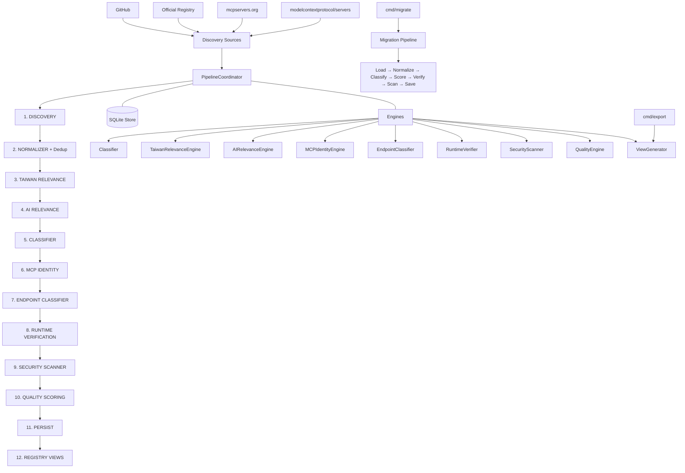

<div align="center">

[English](README.md) | [繁體中文](README.zh-TW.md) | [简体中文](README.zh-CN.md)

</div>

# Taiwan AI Ecosystem Registry

Automated crawler and registry builder for discovering, analyzing, and verifying Taiwan-related AI tools, MCP servers, datasets, and infrastructure.

## Overview

The **Taiwan AI Ecosystem Registry** crawls multiple sources (GitHub, official registries, community platforms) to discover AI-related entities — including MCP servers, AI tools, datasets, SDKs, and infrastructure — with Taiwan relevance. It normalizes, deduplicates, classifies, verifies, scans for security issues, scores quality, and exports a standardized registry.

The crawler identifies entities related to Taiwan through keyword matching, official domains (e.g. `.gov.tw`, `.org.tw`), government APIs, financial APIs (TWSE, TPEx), real estate data, and Traditional Chinese language detection.

**Pipeline:** Discovery → Normalize → Taiwan Relevance → AI Relevance → Classify → MCP Identity → Runtime Verify → Security Scan → Quality Score → Persist → Export

### Core Principles

- **Discovery Broadly**: Cast wide nets across multiple sources to find candidate entities
- **Classify Explicitly**: Apply deterministic and LLM-based classification rules to categorize entities
- **Verify Objectively**: Runtime protocol verification and security scanning provide objective quality signals
- **Publish Conservatively**: Only well-verified, high-quality entities make it to the published registry

### Architectural Rule

```text
DISCOVER BROADLY
      ↓
CLASSIFY EXPLICITLY
      ↓
VERIFY OBJECTIVELY
      ↓
PUBLISH CONSERVATIVELY
```

MCP is a **classification category**, not the discovery boundary. The system discovers broadly across the AI ecosystem and classifies each entity explicitly. "MCP mentioned" ≠ "MCP used" ≠ "MCP client" ≠ "MCP server" ≠ "Verified MCP server." These are separate states and remain separate in the data model (spec §63).

## Supported Entity Types

The classifier supports the following primary classifications (spec §11):

| Category | Primary Classification |
|---|---|
| **MCP** | `MCP_SERVER`, `MCP_CLIENT`, `MCP_HOST`, `MCP_SDK`, `MCP_LIBRARY`, `MCP_EXTENSION`, `MCP_SKILL`, `MCP_COLLECTION` |
| **AI** | `AI_AGENT`, `AI_APPLICATION`, `AI_TOOL`, `AI_SDK`, `AI_FRAMEWORK`, `AI_SKILL`, `AI_KNOWLEDGE_BASE`, `AI_DATASET`, `AI_API`, `AI_INFRASTRUCTURE`, `AI_PLUGIN`, `AI_TUTORIAL`, `AI_EXAMPLE`, `AI_COLLECTION`, `AI_REGISTRY` |
| **Other** | `DATA_LIBRARY`, `DATASET`, `API`, `CLI`, `WEB_APPLICATION`, `DATABASE`, `RESEARCH`, `TUTORIAL`, `COLLECTION`, `OTHER`, `NOT_AI_PROJECT`, `UNKNOWN` |

## Registry Views

The pipeline generates multiple registry views for different consumers (spec §44, §53):

| View | Description |
|---|---|
| `taiwan-ai-ecosystem.md` / `.json` | All Taiwan AI ecosystem entities (T1+) |
| `taiwan-mcp.md` / `.json` | Verified MCP Servers (Runtime Verified, T1+, not security-blocked) |
| `taiwan-mcp-candidates.md` / `.json` | MCP Server Candidates (Candidate, Static Verified) |
| `taiwan-ai-agents.md` / `.json` | Taiwan AI Agents |
| `taiwan-ai-tools.md` / `.json` | Taiwan AI Tools, SDKs, Frameworks, Plugins |
| `taiwan-ai-data.md` / `.json` | Taiwan AI Datasets, Data Libraries, APIs |
| `taiwan-ai-skills.md` / `.json` | AI Skills and MCP Skills |
| `taiwan-ai-infrastructure.md` / `.json` | AI Infrastructure entities |
| `taiwan-ai-tutorials.md` / `.json` | AI Tutorials and Examples |
| `taiwan-ai-collections.md` / `.json` | AI Collections, Registries, MCP Collections |
| `awesome-taiwan-mcp.md` | Legacy MCP-only view (backward compatible, see spec §53) |

## Architecture



The `PipelineCoordinator` (`internal/coordinator/coordinator.go`) orchestrates 10 ordered stages. Each stage is independent (spec §45): Taiwan relevance, AI relevance, MCP identity, runtime verification, security status, and quality score are computed independently and never combined into one score.

A standalone **Migration CLI** (`cmd/migrate/main.go`) re-processes existing database records through the full pipeline. A standalone **Export CLI** (`cmd/export/main.go`) reads from the database and calls the ViewGenerator.

## Project Structure

```
├── cmd/
│   ├── crawler/              # Main CLI entry point (cobra)
│   │   └── main.go           # Commands: run, crawl, discover, classify, verify, scan,
│   │                         #   score, migrate, export, search, stats, version
│   ├── migrate/              # Standalone migration CLI
│   │   └── main.go           # Full pipeline: load→normalize→classify→score→verify→scan→save
│   └── export/               # Standalone export tool
│       └── main.go           # Reads from DB, calls ViewGenerator
├── internal/
│   ├── classify/             # Legacy Taiwan relevance classification (keywords, LLM, rules)
│   ├── config/               # Signal configuration (taiwan_signals.yaml, ai_signals.yaml)
│   ├── coordinator/          # New pipeline orchestration
│   │   ├── coordinator.go    # PipelineCoordinator (10-stage pipeline)
│   │   └── stages.go         # Stage interface + Pipeline struct
│   ├── crawler/              # Legacy crawler pipeline
│   │   ├── coordinator.go    # CrawlCoordinator
│   │   ├── incremental.go    # IncrementalCrawler
│   │   └── run/              # Crawl run management
│   ├── dedupe/               # Deduplication engine (canonical identity)
│   ├── engines/              # Classification and verification engines
│   │   ├── classifier.go     # Entity classification (25 primary types)
│   │   ├── taiwan_relevance.go # Taiwan relevance engine (spec §17)
│   │   ├── ai_relevance.go   # AI relevance engine (spec §10)
│   │   ├── mcp_identity.go   # MCP identity detection engine
│   │   ├── endpoint_classifier.go # Endpoint URL type classification
│   │   ├── runtime_verifier.go # MCP protocol handshake verification
│   │   ├── security_scanner.go # Security scanning (6 detection categories)
│   │   ├── quality_engine.go  # Quality scoring (10 components, 0-100)
│   │   ├── acceptance_test.go  # Acceptance test suite (spec §56, 12 tests)
│   │   └── fp_rate_test.go    # False positive rate test (spec §58)
│   ├── evidence/             # Evidence collection
│   ├── export/               # View generation and export
│   │   ├── view_generator.go # RegistryView generation (9 views + legacy)
│   │   └── exporter.go       # Legacy markdown export
│   ├── health/               # Endpoint health checking
│   ├── manifest/             # MCP manifest parsing
│   ├── metrics/              # Structured JSON logging
│   ├── models/               # Data models
│   │   ├── entity.go         # Entity struct, enums, lifecycle methods
│   │   ├── classification.go # PrimaryClassification enum (25 types), MCPRole
│   │   └── models.go         # Legacy MCPServer, Status, HealthStatus, etc.
│   ├── normalize/            # Normalizer (RawRecord → MCPServer)
│   ├── sources/              # Source adapters
│   │   ├── github/           # GitHub repository search/discovery
│   │   ├── githubrepo/       # GitHub directory-based (modelcontextprotocol/servers)
│   │   ├── registry/         # Official MCP registry adapter
│   │   ├── mcpserversorg/    # mcpservers.org via Sitemap + goquery
│   │   └── mcpmarket/        # mcpmarket.com adapter
│   ├── storage/              # SQLite persistence
│   │   ├── store.go          # Legacy MCPServer storage
│   │   ├── entity_store.go    # New Entity storage (schema_v2)
│   │   ├── schema_v2.sql      # New entities schema
│   │   └── migrations.go      # V1→V2 migration logic
│   └── verify/               # Repository + MCP protocol verification
├── config/
│   ├── pipeline.yaml         # Pipeline stage configuration
│   ├── taiwan_signals.yaml   # Taiwan signal keywords
│   ├── ai_signals.yaml       # AI signal keywords
│   ├── keywords.yaml         # Discovery query keywords
│   └── domains.yaml          # Official Taiwan domains
├── tests/
│   ├── fixtures/
│   │   ├── acceptance/       # Acceptance test fixtures (incl. MCP test server)
│   │   ├── golden/           # Golden regression test data
│   │   └── ground_truth/     # FP rate test ground truth (50 pos, 100 neg)
│   ├── integration/          # E2E pipeline tests
│   ├── unit/                 # Unit + golden regression tests
│   └── benchmarks/           # Performance benchmarks
├── migrations/               # Database migration files
├── Dockerfile                # Multi-stage: golang:1.26-alpine → alpine:latest
├── docker-compose.yaml       # crawler service
└── .golangci.yml             # Linter config
```

## Requirements

- **Go** 1.25+
- **GITHUB_TOKEN** — GitHub API token for repository discovery
- **OPENAI_API_KEY** — (optional) For LLM classification of ambiguous candidates
- **OPENAI_BASE_URL** — (optional) OpenAI-compatible API endpoint
- **Docker** — For container builds

## Installation

### Build from source

```bash
# Build all CLIs
go build -o crawler ./cmd/crawler
go build -o migrator ./cmd/migrate
go build -o exporter ./cmd/export
```

### Docker

```bash
docker build -t awesome-taiwan-ai-ecosystem .
```

## Configuration

| Environment Variable | Required | Default | Description |
|---|---|---|---|
| `GITHUB_TOKEN` | Yes | — | GitHub API token for repository search and fetch |
| `OPENAI_API_KEY` | No | — | OpenAI-compatible API key for LLM classification |
| `OPENAI_BASE_URL` | No | `https://opencreate.ai/zen/v1` | OpenAI-compatible API base URL |
| `OPENAI_MODEL` | No | — | Override model for this crawler instance only |

CLI flags:

| Flag | Default | Description |
|---|---|---|
| `--source` | `all` | Source to crawl: `github`, `registry`, `mcpserversorg`, `mcpmarket`, or `all` |
| `--workers` | `4` | Number of workers per source |
| `--max-per-source` | `10` | Maximum candidates per source (0 = unlimited) |
| `--incremental` | `false` | Run incremental crawl (only re-crawl changed candidates) |
| `--full` | `false` | Force full crawl |
| `--db` | `./data/registry.db` | SQLite database path |
| `--config` | `config/sources.yaml` | Config file path |
| `--markdown` | `false` | Generate human-readable markdown (export subcommand) |
| `--capability` | — | Search by capability keywords (search subcommand) |
| `--min-score` | `0` | Minimum quality score filter |
| `--level` | — | Filter by Taiwan relevance level (T0-T5) |
| `--category` | — | Filter by category |
| `--json` | `false` | Output JSON format |
| `--dry-run` | `false` | Validate without writing changes |
| `--verbose` | `false` | Enable verbose logging |

## Quick Start

```bash
# 1. Build the CLIs
go build -o crawler ./cmd/crawler
go build -o migrator ./cmd/migrate
go build -o exporter ./cmd/export

# 2. Run the full pipeline (discovery + classification + verification + scoring)
export GITHUB_TOKEN=your_github_token_here
./crawler run --source github --workers 4 --max-per-source 10

# Also crawl mcpservers.org (10k+ candidates via Sitemap)
./crawler run --source mcpserversorg --workers 2 --max-per-source 100

# 3. Run migration pipeline (reclassify existing entities)
./migrator --db ./data/registry.db --dry-run

# 4. Export registry views
./exporter --db ./data/registry.db --markdown

# 5. Search entities
./crawler search "taiwan"
./crawler search --capability "filesystem"

# 6. View stats
./crawler stats
```

### CLI Commands

```bash
# Main CLI (cmd/crawler)
crawler run        # Full pipeline: discover → normalize → classify → verify → scan → score → export
crawler crawl      # Alias for `run`
crawler discover   # Discovery stage only (fetch from sources)
crawler classify   # Classification + Taiwan/AI scoring + MCP identity
crawler verify     # Runtime verification (MCP protocol handshake)
crawler scan       # Security scanning
crawler score      # Quality scoring
crawler migrate    # Database schema migration (V1→V2)
crawler export     # Export registry views (JSON + Markdown)
crawler search     # Search the registry
crawler stats      # View aggregate statistics
crawler version    # Print version information

# Migration CLI (cmd/migrate) — standalone full pipeline
migrator --db ./data/registry.db --dry-run    # Dry run (no writes)
migrator --db ./data/registry.db --resume     # Resume from checkpoint

# Export CLI (cmd/export) — standalone export tool
exporter --db ./data/registry.db --markdown   # Generate all views + markdown
```

## Usage

### Run (Full Pipeline)

```bash
# Full pipeline run
./crawler run --source all --workers 4

# Incremental run (only re-crawl changed candidates)
./crawler run --incremental --source github

# Limit candidates per source
./crawler run --source github --max-per-source 20
```

### Individual Pipeline Stages

```bash
# Discovery only
./crawler discover --source github --max-per-source 50

# Classification only (processes candidates already in DB)
./crawler classify --dry-run

# Runtime verification on STATIC_VERIFIED servers
./crawler verify

# Security scanning
./crawler scan

# Quality scoring
./crawler score
```

### Migration

```bash
# Migrate existing V1 database records through the full classification pipeline
./migrator --db ./data/registry.db --dry-run

# Resume interrupted migration
./migrator --db ./data/registry.db --resume

# Full migration with database writes
./migrator --db ./data/registry.db
```

### Export

```bash
# Generate all registry views via standalone export CLI
./exporter --db ./data/registry.db --markdown

# Or using the main CLI
./crawler export --markdown
```

Output files in `registry/views/`:

| File | Description |
|---|---|
| `taiwan-ai-ecosystem.json` / `.md` | All Taiwan AI entities (T1+) |
| `taiwan-mcp.json` / `.md` | Verified MCP Servers |
| `taiwan-mcp-candidates.json` / `.md` | MCP Server Candidates |
| `taiwan-ai-agents.json` / `.md` | Taiwan AI Agents |
| `taiwan-ai-tools.json` / `.md` | Taiwan AI Tools, SDKs, Frameworks |
| `taiwan-ai-data.json` / `.md` | Taiwan AI Datasets, Data Libraries |
| `taiwan-ai-skills.json` / `.md` | AI/MCP Skills |
| `taiwan-ai-infrastructure.json` / `.md` | AI Infrastructure |
| `taiwan-ai-tutorials.json` / `.md` | Tutorials and Examples |
| `taiwan-ai-collections.json` / `.md` | Collections and Registries |
| `awesome-taiwan-mcp.md` | Legacy MCP-only view (backward compatible) |

### Search

```bash
# Text search
./crawler search "financial"
./crawler search --level T3

# Capability search
./crawler search --capability "filesystem"
./crawler search --capability "database"

# Quality filter
./crawler search --min-score 70

# JSON output
./crawler search "taiwan" --json
```

### Stats

```bash
./crawler stats
```

## Data Model

### Entity (canonical model — spec §37, §61 Phase 1)

The `Entity` struct (`internal/models/entity.go`) is the canonical model for all AI ecosystem entities. It replaces the legacy `MCPServer` type while maintaining backward compatibility via `ToMCPServerView()`.

| Field | Type | Description |
|---|---|---|
| `id` | `string` | SHA256 of normalized repository URL |
| `name` | `string` | Display name |
| `slug` | `string` | URL-safe slug |
| `description` | `string` | Short description |
| `entity_status` | `EntityStatus` | `DISCOVERED`, `CANDIDATE`, `VERIFIED`, `QUARANTINED`, `REJECTED` |
| `classification` | `ClassificationResult` | Primary classification + confidence + evidence + MCP role |
| `taiwan_relevance` | `TaiwanRelevance` | Score (0-100), level (T0-T5), evidence, confidence |
| `ai_relevance` | `AIRelevance` | Score (0-100), level (A0-A5), evidence, confidence |
| `mcp_identity` | `MCPIdentity` | Status (CANDIDATE/STATIC_VERIFIED/RUNTIME_VERIFIED/NOT_MCP), evidence, confidence, role |
| `endpoints` | `[]EndpointWithType` | Classified endpoints with type and evidence |
| `tools` | `[]Tool` | Extracted MCP tools |
| `resources` | `[]Resource` | Extracted MCP resources |
| `prompts` | `[]Prompt` | Extracted MCP prompts |
| `data_sources` | `[]DataSource` | Data sources used by the entity |
| `quality` | `QualityScore` | Score (0-100), grade (A-F), 10 components |
| `security_status` | `SecurityStatusDetail` | Security scan result (CLEAR/QUARANTINED/BLOCKED), findings |
| `runtime_verification` | `*RuntimeVerification` | MCP protocol handshake result |
| `first_seen` / `last_seen` | `RFC3339Time` | Discovery timestamps |
| `sources` | `[]SourceReference` | Discovery source references with trust scores |

### Entity Status Lifecycle

```text
DISCOVERED → CANDIDATE → VERIFIED
                       → QUARANTINED → REJECTED
                                     → VERIFIED (false positive)
                       → REJECTED (non-AI)
VERIFIED → REJECTED (later issues found)
```

### Independent Dimensions

Per spec §45, the following properties are independently computed and never combined into one score:

- `taiwan_relevance`
- `ai_relevance`
- `mcp_identity`
- `runtime_verification`
- `security_status`
- `quality`

### Registry Views (spec §44)

Views are generated by filtering entities by classification + MCP identity:

- **MCP Servers**: `primary == MCP_SERVER` AND `identity.status == RUNTIME_VERIFIED`
- **MCP Candidates**: `primary == MCP_SERVER` AND `identity.status IN (CANDIDATE, STATIC_VERIFIED)`
- **AI Agents**: `primary == AI_AGENT`
- **AI Data**: `primary IN (DATA_LIBRARY, DATASET, AI_KNOWLEDGE_BASE)`

## Scoring

### Taiwan Relevance (spec §17)

Deterministic scoring with no LLM dependency:

| Rule | Points | Evidence Type |
|---|---|---|
| Official Taiwan domain (.gov.tw, .org.tw, .com.tw) | +40 | `official_domain` |
| Taiwan government API detected | +40 | `official_gov_api` |
| Taiwan financial API (TWSE, TPEx, TAIFEX, TDCC, FinMind, Fugle) | +35 | `taiwan_financial_api` |
| Taiwan-specific dataset detected | +30 | `taiwan_dataset` |
| Taiwan-specific keyword in repo name/description | +20 | `repository_keyword` |
| Taiwan language (zh-TW, Traditional Chinese) | +15 | `taiwan_language` |
| Taiwan company/service detected | +15 | `taiwan_company` |
| README mentions Taiwan | +5 | `readme_mention` |

Level thresholds: T5 (≥70), T4 (≥55), T3 (≥40), T2 (≥20), T1 (≥5), T0 (<5)

### AI Relevance (spec §10)

Deterministic scoring based on: repository topics, description keywords, package patterns, data source types, tool functionality. Signals configured via `config/ai_signals.yaml`.

Level thresholds: A5 (≥80), A4 (≥65), A3 (≥50), A2 (≥25), A1 (≥1), A0 (<1)

### Quality Score (spec §31)

10 components, total 100 points, A-F grade:

| Component | Max | Based on |
|---|---|---|
| Data Source | 20 | Official Taiwan API (20), Gov OpenData (18), Company API (15), etc. |
| Maintenance | 15 | Last commit date (<90d: 15, 90-180d: 12, etc.) |
| Documentation | 10 | README presence, length, setup instructions, examples |
| MCP Compliance | 15 | Manifest/config, stdio + HTTP + SSE + streamable-http support |
| Tool Schema | 10 | Tools with name + description + input schema |
| Health | 10 | Endpoint health (HEALTHY: 10, DEGRADED: 5) |
| Repository | 5 | Repository accessible + stars |
| License | 5 | License present (3), permissive (2) |
| Security | 5 | No critical findings (-5 to +5) |
| Community | 5 | Stars, forks, topics |

Grades: A (≥90), B (≥80), C (≥70), D (≥60), F (<60)

Quality scoring is **deterministic** — same input always produces the same score. LLM is never used for quality scoring.

## Security Scanning

The `SecurityScanner` (`internal/engines/security_scanner.go`) performs static analysis only — it **never executes discovered code** (spec §60, algs/verification.md). Detection categories:

| Category | What it detects |
|---|---|
| Obfuscation | Base64/hex encoded payloads, `eval`, `exec`, `Function(...)` |
| Credential Extraction | Hardcoded API keys, passwords, tokens (AWS, GitHub, OpenAI patterns) |
| Remote Binary Downloads | `curl\|bash`, `wget\|sh`, download-and-execute patterns |
| Shell Injection | `child_process`, `os.system`, `subprocess`, unsanitized command execution |
| Persistence | Cron, systemd, startup scripts, registry modifications |
| Network Beaconing | Suspicious C2 domain patterns, periodic network calls |
| Filesystem Abuse | Writes to `/etc`, `/root`, system directories |
| Localhost Endpoints | HTTP endpoints pointing to localhost (security risk for production) |

Entities with suspicious code are **quarantined** (spec §35, §56 Test 12) and excluded from published views.

## Runtime Verification

The `RuntimeVerifier` (`internal/engines/runtime_verifier.go`) performs MCP protocol handshake verification:

1. **Connect** to the endpoint (HTTP SSE/Streamable HTTP or stdio subprocess)
2. **Initialize** — send `initialize` request, expect valid response with `protocolVersion` and `capabilities`
3. **Tools list** — request `tools/list`, expect array of tools with valid names
4. **Resources list** — request `resources/list` (if supported)
5. **Prompts list** — request `prompts/list` (if supported)

Only after successful verification does an entity's `MCPIdentity.Status` advance to `RUNTIME_VERIFIED`.

**Security constraint**: MCP protocol verification only sends `initialize` and `tools/list` requests — it **never executes tools or sends arbitrary payloads** (spec §26, algs/verification.md).

## Error Handling

- **Rate limiting**: Exponential backoff (1s → 2s → 4s → 8s, capped at 30s, max 3 retries)
- **Source degradation**: Failed sources are logged and skipped, pipeline continues
- **LLM failures**: Fallback to deterministic classification
- **Network timeouts**: Context-cancellable throughout pipeline
- **Per-entity isolation**: One entity's failure does not block others

## Testing

```bash
# All tests
go test ./... -count=1 -timeout=120s

# Acceptance tests (spec §56: 12 test cases)
go test ./internal/engines/... -run TestAcceptance -v -count=1

# False Positive Rate test (spec §58: MCP FP rate < 5%)
go test ./internal/engines/... -run TestFPRate -v -count=1

# With race detector
go test -race ./internal/... -count=1 -timeout=120s

# Coverage (by package)
go test ./... -count=1 -cover

# Integration tests
go test ./tests/integration/ -v

# CI pipeline (equivalent)
go build ./... && go vet ./... && go test ./... -cover -timeout 120s
```

### Acceptance Tests (spec §56)

The acceptance test suite (`internal/engines/acceptance_test.go`) covers all 12 spec test cases plus edge cases:

| Test | Scenario | Expected |
|---|---|---|
| 1 | README mentions MCP, no implementation | NOT MCP_SERVER, NOT_MCP |
| 2 | SDK dependency only, client-only | MCP_CLIENT |
| 3 | Server implementation (McpServer, StdioServerTransport, entry point) | MCP_SERVER |
| 4 | Runtime verification (MCP protocol handshake) | RUNTIME_VERIFIED |
| 5 | GitHub URL | REPOSITORY_URL (never MCP_RUNTIME_ENDPOINT) |
| 6 | Documentation URL | DOCUMENTATION_URL |
| 7 | Installer URL | INSTALLER_URL |
| 8 | Collection repository | MCP_COLLECTION |
| 9 | Tutorial | MCP_TUTORIAL |
| 10 | Data SDK | DATA_LIBRARY |
| 11 | AI Agent using MCP | AI_AGENT (MCP role = CLIENT) |
| 12 | Suspicious code | QUARANTINED |

### False Positive Rate Test (spec §58)

| Metric | Value |
|---|---|
| Ground truth samples | 150 (50 positive, 100 negative) |
| False Positive Rate | 0.0000 |
| Precision | 1.0000 |
| Recall | 1.0000 |
| F1 Score | 1.0000 |
| Status | EXCELLENT (target: <5%, long-term: <2%) |

Test fixtures: `tests/fixtures/ground_truth/{positive,negative}/`

## Build

```bash
# Standard build
go build ./...

# Vet
go vet ./...

# Module verification
go mod verify

# Docker
docker build -t awesome-taiwan-ai-ecosystem .
docker compose up
```

### Makefile

A `Makefile` is provided for common development tasks:

```bash
make build         # Build all binaries (crawler, migrator, exporter)
make test          # Run all tests
make test-acceptance  # Run acceptance tests (spec §56)
make test-fp       # Run false positive rate test (spec §58)
make vet           # Run go vet
make fmt           # Format source code
make lint          # Run linter
make clean         # Clean build artifacts and data
```


### Docker

The Dockerfile uses multi-stage build:
1. **Builder**: `golang:1.26-alpine3.24` — compiles the binary
2. **Runtime**: `alpine:latest` — runs the binary as non-root user

Security: non-root user (uid 1000), no privileged, resource limits, read-only filesystem with tmpfs.

```bash
docker build -t awesome-taiwan-ai-ecosystem .
docker run --rm \
  -e GITHUB_TOKEN=your_token \
  -v $(pwd)/data:/data \
  awesome-taiwan-ai-ecosystem run --db /data/registry.db
```

### Docker Compose: Search

Search runs against the persisted SQLite database. When the crawler container has completed a run, the database is stored in `./data/registry.db`. Use the following commands to search inside Docker Compose:

```bash
# Ensure the database and views are mounted locally (docker-compose.yaml maps ./data:/data/db)

# Search by text
docker compose run --rm crawler search "taiwan" --db /data/db/registry.db

# Search with level filter
docker compose run --rm crawler search "mcp" --db /data/db/registry.db --level T3

# Search by capability
docker compose run --rm crawler search --db /data/db/registry.db --capability "filesystem"

# Search with minimum quality score
docker compose run --rm crawler search "ai" --db /data/db/registry.db --min-score 70

# JSON output
docker compose run --rm crawler search "taiwan" --db /data/db/registry.db --json
```

The `--rm` flag removes the container after the command exits, and `--db /data/db/registry.db` points to the mounted volume. For other CLI operations (stats, export), use the same pattern:

```bash
# View stats
docker compose run --rm crawler stats --db /data/db/registry.db --json

# Export all views
docker compose run --rm crawler export --db /data/db/registry.db --markdown
```

## REST API (T048)

The API server provides HTTP endpoints for registry search and metadata.

```bash
# Build and run
go build -o bin/api ./cmd/api
./bin/api --port 8080 --db ./data/registry.db --rate-limit 100

# Or via Makefile
make api
```

### API Endpoints

| Method | Path | Description |
|---|---|---|
| `GET` | `/health` | Server health check |
| `GET` | `/api/v1/health` | Server health check (API namespace) |
| `GET` | `/api/v1/servers` | List servers with pagination & filters |
| `GET` | `/api/v1/servers/{id}` | Get a single server by ID |
| `GET` | `/api/v1/search?q=...` | Search servers by keyword + filters |
| `GET` | `/api/v1/registry` | Full registry dump |
| `GET` | `/api/v1/statistics` | Registry statistics |

### Query Parameters

```
# List servers
GET /api/v1/servers?page=1&limit=50&level=T3&category=AI_AGENT&min-score=70&status=VERIFIED

# Search
GET /api/v1/search?q=taiwan&level=T4&category=MCP_SERVER&min-score=80&page=1&limit=50
```

Pagination: `page` (default 1), `limit` (default 50, max 200).

Rate limiting: 100 requests/minute per IP (configurable via `--rate-limit`).

### Docker Compose

```bash
# API server
docker compose up api

# Full stack (crawler + API + Web UI)
docker compose up
```

API will be available at `http://localhost:8080`.

## Web UI (T049)

The Web UI is a React + Vite + TypeScript application with Tailwind CSS styling.

```bash
# Install dependencies and run dev server
cd web && pnpm install && pnpm run dev

# Build for production
cd web && pnpm run build

# Via Makefile
make web-build    # build for production
make web-dev      # run dev server
```

### Pages

| Route | Description |
|---|---|
| `/` | Dashboard — statistics, Taiwan level breakdown, health, quality grades |
| `/servers` | Server list — search, filter by level/category/health/quality, pagination |
| `/servers/:id` | Server detail — full metadata, tools, resources, endpoints |
| `/search` | Search — keyword search with filters |

The Web UI calls the REST API (T048) for all data. In Docker, the Web UI is built as static files served by nginx.


## Development

```bash
# Install dependencies
go mod download

# Run linter
golangci-lint run

# Format
gofmt -s -w .

# Run all tests
go test ./... -count=1 -timeout=120s

# Run acceptance tests
go test ./internal/engines/... -run TestAcceptance -v -count=1

# Run FP rate test
go test ./internal/engines/... -run TestFPRate -v -count=1

# Run tests for a specific package
go test ./internal/engines/ -v
```

## Known Limitations

- **mcpmarket source**: `mcpmarket.com` is blocked by Vercel WAF in sandboxed environments
- **Official registry**: `api.mcp-servers.dev` may be unavailable in sandboxed environments (DNS resolution failure)
- **GitHub rate limits**: 5000 requests/hour per token
- **LLM classifier**: Requires `OPENAI_API_KEY` env var; gracefully degrades to deterministic classification
- **Incremental crawl**: Uses last crawl timestamp from SQLite; requires prior crawl data
- **MCP protocol verification**: Requires publicly accessible HTTP endpoints (SSE/Streamable HTTP); stdio servers are spawned as subprocesses
- **CI workflow**: See `.github/workflows/ci.yml` for CI pipeline details

## License

This project is licensed under the **Apache License 2.0**. See [`LICENSE`](LICENSE) file for details.
