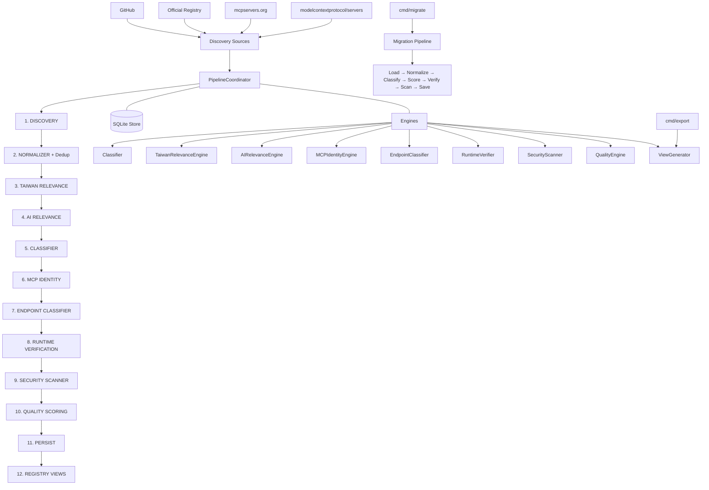

<div align="center">

[English](README.md) | [繁体中文](README.zh-TW.md) | [简体中文](README.zh-CN.md)

</div>

# Taiwan AI Ecosystem Registry

自动化爬虫与注册表建立工具，用于发现、分析和验证与台湾相关的 AI 工具、MCP 服务器、资料集和基础架构。

## 概述

**Taiwan AI Ecosystem Registry** 从多个来源（GitHub、官方注册表、社群平台）爬取 AI 相关实体，包括 MCP 服务器、AI 工具、资料集、SDK 和基础架构等，筛选出与台湾相关的项目。爬虫会进行标准化、去重、分类、验证、安全扫描、品质评分，并汇出标准化的注册表。

透过关键字匹配、官方网域（如 `.gov.tw`、`.org.tw`）、政府 API、金融 API（TWSE、TPEx）、不动产资料，以及繁体中文语言侦测来识别台湾相关的实体。

**Pipeline:** Discovery → Normalize → Taiwan Relevance → AI Relevance → Classify → MCP Identity → Runtime Verify → Security Scan → Quality Score → Persist → Export

### 核心原则

- **Discovery Broadly**：从多个来源广泛发现候选实体
- **Classify Explicitly**：应用确定性与 LLM 分类规则对实体进行分类
- **Verify Objectively**：执行阶段验证与安全扫描，提供客观品质信号
- **Publish Conservatively**：只有品质良好且验证通过的实体才会放入已发布注册表

### 架构原则

```text
DISCOVER BROADLY
      ↓
CLASSIFY EXPLICITLY
      ↓
VERIFY OBJECTIVELY
      ↓
PUBLISH CONSERVATIVELY
```

MCP 是**分类类别**，而不是发现的边界。系统从 AI 生态系统广泛发现，并对每个实体进行明确分类。「提及 MCP」 ≠「使用 MCP」 ≠「MCP 客户端」 ≠「MCP 服务器」 ≠「验证通过的 MCP 服务器」。这些是独立的状态，在资料模型中保持分离（规格 §63）。

## 支援的实体类型

分类器支援以下主要分类（规格 §11）：

| 分类 | 主要分类 |
|---|---|
| **MCP** | `MCP_SERVER`, `MCP_CLIENT`, `MCP_HOST`, `MCP_SDK`, `MCP_LIBRARY`, `MCP_EXTENSION`, `MCP_SKILL`, `MCP_COLLECTION` |
| **AI** | `AI_AGENT`, `AI_APPLICATION`, `AI_TOOL`, `AI_SDK`, `AI_FRAMEWORK`, `AI_SKILL`, `AI_KNOWLEDGE_BASE`, `AI_DATASET`, `AI_API`, `AI_INFRASTRUCTURE`, `AI_PLUGIN`, `AI_TUTORIAL`, `AI_EXAMPLE`, `AI_COLLECTION`, `AI_REGISTRY` |
| **其他** | `DATA_LIBRARY`, `DATASET`, `API`, `CLI`, `WEB_APPLICATION`, `DATABASE`, `RESEARCH`, `TUTORIAL`, `COLLECTION`, `OTHER`, `NOT_AI_PROJECT`, `UNKNOWN` |

## 注册表视图

Pipeline 会产生多个注册表视图供不同消费者使用（规格 §44, §53）：

| 视图 | 说明 |
|---|---|
| `taiwan-ai-ecosystem.md` / `.json` | 所有台湾 AI 生态系统实体 (T1+) |
| `taiwan-mcp.md` / `.json` | 验证通过的 MCP 服务器 (Runtime Verified, T1+, 未被安全封锁) |
| `taiwan-mcp-candidates.md` / `.json` | MCP 服务器候选 (Candidate, Static Verified) |
| `taiwan-ai-agents.md` / `.json` | 台湾 AI 代理 |
| `taiwan-ai-tools.md` / `.json` | 台湾 AI 工具、SDK、框架、插件 |
| `taiwan-ai-data.md` / `.json` | 台湾 AI 资料集、资料库、API |
| `taiwan-ai-skills.md` / `.json` | AI/MCP 技能 |
| `taiwan-ai-infrastructure.md` / `.json` | AI 基础架构 |
| `taiwan-ai-tutorials.md` / `.md` | 教学与范例 |
| `taiwan-ai-collections.md` / `.json` | 收集与注册表 |
| `awesome-taiwan-mcp.md` | 传统 MCP 专用视图 (向后兼容，见规格 §53) |

## 架构



`PipelineCoordinator` (`internal/coordinator/coordinator.go`) 协调 10 个有序阶段。每个阶段都是独立的（规格 §45）：台湾相关性、AI 相关性、MCP 身分、执行阶段验证、安全状态和品质分数都是独立计算的，永远不会合并为单一分数。

独立的 **Migration CLI** (`cmd/migrate/main.go`) 重新处理现有资料库记录，执行完整的分类 Pipeline。独立的 **Export CLI** (`cmd/export/main.go`) 从资料库读取并呼叫 ViewGenerator。

## 专案结构

```
├── cmd/
│   ├── crawler/              # 主要 CLI 进入点 (cobra)
│   │   └── main.go           # 指令: run, crawl, discover, classify, verify, scan,
│   │                         #   score, migrate, export, search, stats, version
│   ├── migrate/              # 独立迁移 CLI
│   │   └── main.go           # 完整 Pipeline: load→normalize→classify→score→verify→scan→save
│   └── export/               # 独立汇出工具
│       └── main.go           # 从资料库读取，呼叫 ViewGenerator
├── internal/
│   ├── classify/             # 台湾相关性分类 (关键字、LLM、规则)
│   ├── config/               # 信号配置 (taiwan_signals.yaml, ai_signals.yaml)
│   ├── coordinator/          # 新版 Pipeline 协调
│   │   ├── coordinator.go    # PipelineCoordinator (10-stage pipeline)
│   │   └── stages.go         # Stage interface + Pipeline struct
│   ├── crawler/              # 传统爬虫 Pipeline
│   │   ├── coordinator.go    # CrawlCoordinator
│   │   ├── incremental.go    # IncrementalCrawler
│   │   └── run/              # 爬虫运行管理
│   ├── dedupe/               # 去重引擎 (正规化身份)
│   ├── engines/              # 分类与验证引擎
│   │   ├── classifier.go     # 实体分类 (25 个主要类型)
│   │   ├── taiwan_relevance.go # 台湾相关性引擎 (规格 §17)
│   │   ├── ai_relevance.go   # AI 相关性引擎 (规格 §10)
│   │   ├── mcp_identity.go    # MCP 身分侦测引擎
│   │   ├── endpoint_classifier.go # 端点 URL 类型分类
│   │   ├── runtime_verifier.go # MCP 协定握手验证
│   │   ├── security_scanner.go # 安全扫描 (6 个检测类别)
│   │   ├── quality_engine.go  # 品质评分 (10 组件, 0-100)
│   │   ├── acceptance_test.go  # 接受测试 (规格 §56, 12 个测试)
│   │   └── fp_rate_test.go    # 假阳性率测试 (规格 §58)
│   ├── evidence/             # 证据收集
│   ├── export/               # 视图生成与汇出
│   │   ├── view_generator.go # RegistryView 生成 (9 个视图 + 传统)
│   │   └── exporter.go       # 传统 Markdown 汇出
│   ├── health/               # 端点健康检查
│   ├── manifest/             # MCP manifest 解析
│   ├── metrics/              # 结构化 JSON 日志
│   ├── models/               # 资料模型
│   │   ├── entity.go         # Entity struct、枚举、生命周期方法
│   │   ├── classification.go # PrimaryClassification 枚举 (25 类型)、MCPRole
│   │   └── models.go         # 传统 MCPServer、Status、HealthStatus 等
│   ├── normalize/            # 正规化 (RawRecord → MCPServer)
│   ├── sources/              # 资料源 adapters
│   │   ├── github/           # GitHub 仓库搜寻/发现
│   │   ├── githubrepo/       # GitHub 目录型 (modelcontextprotocol/servers)
│   │   ├── registry/         # 官方 MCP 注册表
│   │   ├── mcpserversorg/    # mcpservers.org (Sitemap + goquery)
│   │   └── mcpmarket/        # mcpmarket.com
│   ├── storage/              # SQLite 持久化
│   │   ├── store.go          # 传统 MCPServer 存储
│   │   ├── entity_store.go   # 新 Entity 存储 (schema_v2)
│   │   ├── schema_v2.sql     # 新 entities schema
│   │   └── migrations.go     # V1→V2 迁移逻辑
│   └── verify/               # 仓库 + MCP 协定验证
├── config/
│   ├── pipeline.yaml         # Pipeline 阶段配置
│   ├── taiwan_signals.yaml   # 台湾信号关键字
│   ├── ai_signals.yaml       # AI 信号关键字
│   ├── keywords.yaml         # 发现查询关键字
│   └── domains.yaml          # 官方台湾网域
├── tests/
│   ├── fixtures/
│   │   ├── acceptance/       # 接受测试固件 (含 MCP 测试服务器)
│   │   ├── golden/           # Golden regression 测试资料
│   │   └── ground_truth/     # FP rate 测试真值 (50 正例, 100 反例)
│   ├── integration/          # E2E Pipeline 测试
│   ├── unit/                 # 单元 + golden regression 测试
│   └── benchmarks/           # 性能基准测试
├── migrations/               # 资料库迁移文档
├── Dockerfile                # 多阶段建构: golang:1.26-alpine → alpine:latest
├── docker-compose.yaml       # crawler 服务
└── .golangci.yml             # linter 配置
```

## 需求

- **Go** 1.25+
- **GITHUB_TOKEN** — 用于 GitHub API 搜寻与抓取
- **OPENAI_API_KEY** — (选填) 用于模糊候选的 LLM 分类
- **OPENAI_BASE_URL** — (选填) OpenAI-compatible API 端点
- **Docker** — 用于容器建构

## 安装

### 从原始码建构

```bash
# 建构所有 CLI
go build -o crawler ./cmd/crawler
go build -o migrator ./cmd/migrate
go build -o exporter ./cmd/export
```

### Docker

```bash
docker build -t awesome-taiwan-ai-ecosystem .
```

## 配置

| 环境变数 | 必填 | 预设 | 说明 |
|---|---|---|---|
| `GITHUB_TOKEN` | 是 | — | GitHub API Token，用于仓库搜寻与抓取 |
| `OPENAI_API_KEY` | 否 | — | OpenAI-compatible API Key，用于 LLM 分类 |
| `OPENAI_BASE_URL` | 否 | `https://opencreate.ai/zen/v1` | OpenAI-compatible API 基础 URL |
| `OPENAI_MODEL` | 否 | — | 仅覆写 **当前爬虫实例** 的模型 |

CLI 标志：

| 标志 | 预设 | 说明 |
|---|---|---|
| `--source` | `all` | 要爬取的资料源: `github`, `registry`, `mcpserversorg`, `mcpmarket`, 或 `all` |
| `--workers` | `4` | 每个资料源的 worker 数量 |
| `--max-per-source` | `10` | 每个资料源的最大候选数量 (0 = 无限制) |
| `--incremental` | `false` | 执行增量爬取 (仅重新爬取有变更的候选) |
| `--full` | `false` | 强制完整爬取 |
| `--db` | `./data/registry.db` | SQLite 资料库路径 |
| `--config` | `config/sources.yaml` | 配置文档路径 |
| `--markdown` | `false` | 生成人类可读 Markdown (export 子指令) |
| `--capability` | — | 以 capability 关键字搜寻 (search 子指令) |
| `--min-score` | `0` | 最小品质分数过滤 |
| `--level` | — | 依台湾相关性等级过滤 (T0-T5) |
| `--category` | — | 依分类过滤 |
| `--json` | `false` | JSON 输出格式 |
| `--dry-run` | `false` | 验证但不写入变更 |
| `--verbose` | `false` | 启用详细日志 |

## 快速开始

```bash
# 1. 建构 CLI
go build -o crawler ./cmd/crawler
go build -o migrator ./cmd/migrate
go build -o exporter ./cmd/export

# 2. 执行完整 Pipeline
export GITHUB_TOKEN=your_github_token_here
./crawler run --source github --workers 4 --max-per-source 10

# 同时爬取 mcpservers.org (10k+ 候选透过 Sitemap)
./crawler run --source mcpserversorg --workers 2 --max-per-source 100

# 3. 执行迁移 Pipeline (重新分类现有实体)
./migrator --db ./data/registry.db --dry-run

# 4. 汇出注册表视图
./exporter --db ./data/registry.db --markdown

# 5. 搜寻实体
./crawler search "taiwan"
./crawler search --capability "filesystem"

# 6. 查看统计
./crawler stats
```

### CLI 指令

```bash
# 主要 CLI (cmd/crawler)
crawler run        # 完整 Pipeline: discover → normalize → classify → verify → scan → score → export
crawler crawl      # 别名: `run`
crawler discover   # 仅发现阶段 (从资料源抓取)
crawler classify   # 分类 + 台湾/AI 评分 + MCP 身分
crawler verify     # 执行阶段验证 (MCP 协定握手)
crawler scan       # 安全扫描
crawler score      # 品质评分
crawler migrate    # 资料库迁移 (V1→V2)
crawler export     # 汇出注册表视图 (JSON + Markdown)
crawler search     # 搜寻注册表
crawler stats      # 查看聚合统计
crawler version    # 列印版本资讯

# 迁移 CLI (cmd/migrate) — 独立完整 Pipeline
migrator --db ./data/registry.db --dry-run    # 干跑 (不写入)
migrator --db ./data/registry.db --resume     # 从检查点恢复

# 汇出 CLI (cmd/export) — 独立汇出工具
exporter --db ./data/registry.db --markdown   # 生成所有视图 + Markdown
```

## 使用方法

### Run (完整 Pipeline)

```bash
# 完整 Pipeline 执行
./crawler run --source all --workers 4

# 增量执行 (仅重新爬取有变更的候选)
./crawler run --incremental --source github

# 限制每个资料源的候选数量
./crawler run --source github --max-per-source 20
```

### 个别 Pipeline 阶段

```bash
# 仅发现
./crawler discover --source github --max-per-source 50

# 仅分类 (处理已在资料库的候选)
./crawler classify --dry-run

# 执行阶段验证 (对 STATIC_VERIFIED 的服务器)
./crawler verify

# 安全扫描
./crawler scan

# 品质评分
./crawler score
```

### 迁移

```bash
# 将现有 V1 资料库记录重新处理透过完整分类 Pipeline
./migrator --db ./data/registry.db --dry-run

# 恢复中断的迁移
./migrator --db ./data/registry.db --resume

# 完整迁移 (带资料库写入)
./migrator --db ./data/registry.db
```

### 汇出

```bash
# 透过独立汇出 CLI 生成所有注冻视图
./exporter --db ./data/registry.db --markdown

# 或使用主要 CLI
./crawler export --markdown
```

输出档案在 `registry/views/`：

| 档案 | 说明 |
|---|---|
| `taiwan-ai-ecosystem.json` / `.md` | 所有台湾 AI 实体 (T1+) |
| `taiwan-mcp.json` / `.md` | 验证通过的 MCP 服务器 |
| `taiwan-mcp-candidates.json` / `.md` | MCP 服务器候选 |
| `taiwan-ai-agents.json` / `.md` | 台湾 AI 代理 |
| `taiwan-ai-tools.json` / `.md` | 台湾 AI 工具、SDK、框架 |
| `taiwan-ai-data.json` / `.md` | 台湾 AI 资料集、资料库 |
| `taiwan-ai-skills.json` / `.md` | AI/MCP 技能 |
| `taiwan-ai-infrastructure.json` / `.md` | AI 基础架构 |
| `taiwan-ai-tutorials.json` / `.md` | 教学与范例 |
| `taiwan-ai-collections.json` / `.md` | 收集与注册表 |
| `awesome-taiwan-mcp.md` | 传统 MCP 专用视图 (向后兼容) |

### 搜寻

```bash
# 文字搜寻
./crawler search "financial"
./crawler search --level T3

# Capability 搜寻
./crawler search --capability "filesystem"
./crawler search --capability "database"

# 品质过滤
./crawler search --min-score 70

# JSON 输出
./crawler search "taiwan" --json
```

### 统计

```bash
./crawler stats
```

## 资料模型

### Entity (正规化模型 — 规格 §37, §61 Phase 1)

`Entity` 结构 (`internal/models/entity.go`) 是所有 AI 生态系统实体的正规化模型。它取代了传统的 `MCPServer` 类型，同时透过 `ToMCPServerView()` 保持向后兼容。

| 栏位 | 类型 | 说明 |
|---|---|---|
| `id` | `string` | 正规化 repo URL 的 SHA256 |
| `name` | `string` | 显示名称 |
| `slug` | `string` | URL-safe slug |
| `description` | `string` | 简短描述 |
| `entity_status` | `EntityStatus` | `DISCOVERED`, `CANDIDATE`, `VERIFIED`, `QUARANTINED`, `REJECTED` |
| `classification` | `ClassificationResult` | 主要分类 + 信心度 + 证据 + MCP 角色 |
| `taiwan_relevance` | `TaiwanRelevance` | 分数 (0-100)、等级 (T0-T5)、证据、信心度 |
| `ai_relevance` | `AIRelevance` | 分数 (0-100)、等级 (A0-A5)、证据、信心度 |
| `mcp_identity` | `MCPIdentity` | 状态 (CANDIDATE/STATIC_VERIFIED/RUNTIME_VERIFIED/NOT_MCP)、证据、信心度、角色 |
| `endpoints` | `[]EndpointWithType` | 分类过的端点 (含类型与证据) |
| `tools` | `[]Tool` | 撷取的 MCP Tools |
| `resources` | `[]Resource` | 撷取的 MCP Resources |
| `prompts` | `[]Prompt` | 撷取的 MCP Prompts |
| `data_sources` | `[]DataSource` | 实体使用的资料来源 |
| `quality` | `QualityScore` | 分数 (0-100)、等级 (A-F)、10 组件 |
| `security_status` | `SecurityStatusDetail` | 安全扫描结果 (CLEAR/QUARANTINED/BLOCKED) |
| `runtime_verification` | `*RuntimeVerification` | MCP 协定握手结果 |
| `first_seen` / `last_seen` | `RFC3339Time` | 发现时间戳 |
| `sources` | `[]SourceReference` | 发现资料源引用 (含信任分数) |

### 实体状态生命周期

```text
DISCOVERED → CANDIDATE → VERIFIED
                       → QUARANTINED → REJECTED
                                     → VERIFIED (误判)
                       → REJECTED (非 AI)
VERIFIED → REJECTED (日后发现问题)
```

### 独立维度

根据规格 §45，以下属性是独立计算的，永远不会合并为单一分数：

- `taiwan_relevance`
- `ai_relevance`
- `mcp_identity`
- `runtime_verification`
- `security_status`
- `quality`

### 注册表视图 (规格 §44)

视图透过过滤实体的分类 + MCP 身分生成：

- **MCP 服务器**: `primary == MCP_SERVER` AND `identity.status == RUNTIME_VERIFIED`
- **MCP 候选**: `primary == MCP_SERVER` AND `identity.status IN (CANDIDATE, STATIC_VERIFIED)`
- **AI 代理**: `primary == AI_AGENT`
- **AI 资料**: `primary IN (DATA_LIBRARY, DATASET, AI_KNOWLEDGE_BASE)`

## 评分

### 台湾相关性 (规格 §17)

确定性评分，无需 LLM：

| 规则 | 分数 | 证据类型 |
|---|---|---|
| 官方台湾网域 (.gov.tw, .org.tw, .com.tw) | +40 | `official_domain` |
| 台湾政府 API 检测 | +40 | `official_gov_api` |
| 台湾金融 API (TWSE, TPEx, TAIFEX, TDCC, FinMind, Fugle) | +35 | `taiwan_financial_api` |
| 台湾特定资料集检测 | +30 | `taiwan_dataset` |
| 台湾关键字出现在 repo 名称/描述 | +20 | `repository_keyword` |
| 台湾语言 (zh-TW, 繁体中文) | +15 | `taiwan_language` |
| 台湾公司/服务提及 | +15 | `taiwan_company` |
| README 提及台湾 | +5 | `readme_mention` |

等级门槛：T5 (≥70), T4 (≥55), T3 (≥40), T2 (≥20), T1 (≥5), T0 (<5)

### AI 相关性 (规格 §10)

基于以下确定性信号进行评分：仓库 topics、描述关键字、套件模式、资料来源类型、工具功能。信号配置于 `config/ai_signals.yaml`。

等级门槛：A5 (≥80), A4 (≥65), A3 (≥50), A2 (≥25), A1 (≥1), A0 (<1)

### 品质评分 (规格 §31)

10 组件，总分 100 分，A-F 等级：

| 组件 | 最高分 | 依据 |
|---|---|---|
| 资料来源 | 20 | 官方台湾 API (20)、政府开放资料 (18)、公司 API (15) 等 |
| 维护 | 15 | 最后提交日期 (<90天: 15, 90-180天: 12 等) |
| 文档 | 10 | README 存在性、长度、设置说明、范例 |
| MCP 符合度 | 15 | Manifest/config、stdio + HTTP + SSE + streamable-http 支援 |
| Tool Schema | 10 | 拥有 name + description + input schema 的 tools |
| 健康度 | 10 | 端点健康状态 (HEALTHY: 10, DEGRADED: 5) |
| 仓库 | 5 | 仓库可存取 + stars |
| 授权 | 5 | 授权存在 (3)、宽松授权 (2) |
| 安全 | 5 | 无严重发现 (-5 至 +5) |
| 社群 | 5 | Stars、forks、topics |

等级: A (≥90), B (≥80), C (≥70), D (≥60), F (<60)

品质评分是**确定性的** — 相同的输入永远会产生相同的分数。LLM 永远不会用于品质评分。

## 安全扫描

`SecurityScanner` (`internal/engines/security_scanner.go`) 仅执行静态分析 —**永远不会执行发现的程序码** (规格 §60, algs/verification.md)。检测类别：

| 类别 | 侦测内容 |
|---|---|
| 混淆码 | Base64/hex 编码载荷、`eval`、`exec`、`Function(...)` |
| credential extraction | 硬编码 API keys、密码、tokens (AWS、GitHub、OpenAI 模式) |
| 远端二进位下载 | `curl\|bash`、`wget\|sh`、下载并执行模式 |
| 命令注入 | `child_process`、`os.system`、`subprocess`、未经消毒的命令执行 |
| 持续性 | Cron、systemd、启动脚本、注册表修改 |
| 网路信标 | 可疑 C2 域名模式、周期性网路呼叫 |
| 档案系统滥用 | 写入 `/etc`、`/root`、系统目录 |
| Localhost 端点 | 指向 localhost 的 HTTP 端点 (生产环境安全风险) |

含有可疑程序码的实体会被**隔离** (规格 §35, §56 Test 12)，并从已发布的视图中排除。

## 执行阶段验证

`RuntimeVerifier` (`internal/engines/runtime_verifier.go`) 执行 MCP 协定握手验证：

1. **连线** 到端点 (HTTP SSE/Streamable HTTP 或 stdio 子进程)
2. **初始化** — 发送 `initialize` 请求，期望收到有效回应 (含 `protocolVersion` 和 `capabilities`)
3. **工具列表** — 请求 `tools/list`，期望收到拥有有效名称的 tools 阵列
4. **资源列表** — 请求 `resources/list` (若支援)
5. **提示列表** — 请求 `prompts/list` (若支援)

只有在验证成功后，实体的 `MCPIdentity.Status` 才会进阶到 `RUNTIME_VERIFIED`。

**安全限制**: MCP 协定验证仅发送 `initialize` 和 `tools/list` 请求 — **永远不会执行工具或发送任意负载** (规格 §26, algs/verification.md)。

## 错误处理

- **速率限制**: 指数退避 (1s → 2s → 4s → 8s，上限 30s，最多 3 次重试)
- **资料源降级**: 失败的资料源会被记录并跳过，Pipeline 继续执行
- **LLM 失败**: 回退到确定性分类
- **网路逾时**: 整个 Pipeline 均支援 context 取消
- **单实体隔离**: 单一实体的失败不会阻塞其他实体

## 测试

```bash
# 所有测试
go test ./... -count=1 -timeout=120s

# 接受测试 (规格 §56: 12 个测试案例)
go test ./internal/engines/... -run TestAcceptance -v -count=1

# 假阳性率测试 (规格 §58: MCP 假阳性率 < 5%)
go test ./internal/engines/... -run TestFPRate -v -count=1

# 启用 race 检测
go test -race ./internal/... -count=1 -timeout=120s

# 按套件覆盖率
go test ./... -count=1 -cover

# 整合测试
go test ./tests/integration/ -v

# CI Pipeline (等价)
go build ./... && go vet ./... && go test ./... -cover -timeout 120s
```

### 接受测试 (规格 §56)

接受测试套件 (`internal/engines/acceptance_test.go`) 覆盖所有 12 个规格测试案例及边界情况：

| 测试 | 场景 | 预期结果 |
|---|---|---|
| 1 | README 提及 MCP，无实现 | 非 MCP_SERVER，NOT_MCP |
| 2 | SDK 依赖但仅实现 client | MCP_CLIENT |
| 3 | 服务器实现 (McpServer, StdioServerTransport, entry point) | MCP_SERVER |
| 4 | 执行阶段验证 (MCP 协定握手) | RUNTIME_VERIFIED |
| 5 | GitHub URL | REPOSITORY_URL (绝不为 MCP_RUNTIME_ENDPOINT) |
| 6 | 文档 URL | DOCUMENTATION_URL |
| 7 | 安装程序 URL | INSTALLER_URL |
| 8 | 收集库存仓库 | MCP_COLLECTION |
| 9 | 教学 | MCP_TUTORIAL |
| 10 | 资料 SDK | DATA_LIBRARY |
| 11 | 使用 MCP 的 AI 代理 | AI_AGENT (MCP 角色 = CLIENT) |
| 12 | 可疑程序码 | QUARANTINED |

### 假阳性率测试 (规格 §58)

| 指标 | 数值 |
|---|---|
| 真值样本 | 150 (50 正例, 100 反例) |
| 假阳性率 | 0.0000 |
| 精确率 | 1.0000 |
| 召回率 | 1.0000 |
| F1 分数 | 1.0000 |
| 状态 | EXCELLENT (目标: <5%，长期: <2%) |

测试固件: `tests/fixtures/ground_truth/{positive,negative}/`

## 建构

```bash
# 标准建构
go build ./...

# Vet
go vet ./...

# 模组验证
go mod verify

# Docker
docker build -t awesome-taiwan-ai-ecosystem .
docker compose up
```

### Makefile

提供 `Makefile` 用於常用開發任務：

```bash
make build         # Build all binaries (crawler, migrator, exporter)
make test          # Run all tests
make test-acceptance  # Run acceptance tests (spec §56)
make test-fp       # Run false positive rate test (spec §58)
make vet           # Run go vet
make fmt           # Format source code
make lint          # Run linter
make clean         # Clean build artifacts and data
```


### Docker

Dockerfile 使用多阶段建构：
1. **Builder**: `golang:1.26-alpine3.24` — 编译二进位档
2. **Runtime**: `alpine:latest` — 以非 root 用户执行

安全: 非 root 用户 (uid 1000)、无特权、资源限制、唯读档案系统搭配 tmpfs。

```bash
docker build -t awesome-taiwan-ai-ecosystem .
docker run --rm \
  -e GITHUB_TOKEN=your_token \
  -v $(pwd)/data:/data \
  awesome-taiwan-ai-ecosystem run --db /data/registry.db
```

### Docker Compose: Search

Search runs against the persisted SQLite database. When the crawler container has completed a run, the database is stored in `./data/registry.db`. Use the following commands to search inside Docker Compose:

```bash
# Ensure the database and views are mounted locally (docker-compose.yaml maps ./data:/data/db)

# Search by text
docker compose run --rm crawler search "taiwan" --db /data/db/registry.db

# Search with level filter
docker compose run --rm crawler search "mcp" --db /data/db/registry.db --level T3

# Search by capability
docker compose run --rm crawler search --db /data/db/registry.db --capability "filesystem"

# Search with minimum quality score
docker compose run --rm crawler search "ai" --db /data/db/registry.db --min-score 70

# JSON output
docker compose run --rm crawler search "taiwan" --db /data/db/registry.db --json
```

The `--rm` flag removes the container after the command exits, and `--db /data/db/registry.db` points to the mounted volume. For other CLI operations (stats, export), use the same pattern:

```bash
# View stats
docker compose run --rm crawler stats --db /data/db/registry.db --json

# Export all views
docker compose run --rm crawler export --db /data/db/registry.db --markdown
```


## 开发

```bash
# 安装依赖
go mod download

# 执行 linter
golangci-lint run

# 格式化
gofmt -s -w .

# 执行所有测试
go test ./... -count=1 -timeout=120s

# 执行接受测试
go test ./internal/engines/... -run TestAcceptance -v -count=1

# 执行假阳性率测试
go test ./internal/engines/... -run TestFPRate -v -count=1

# 执行特定套件测试
go test ./internal/engines/ -v
```

## 已知限制

- **mcpmarket 资料源**: `mcpmarket.com` 在沙箱环境中被 Vercel WAF 挡住
- **官方注册表**: `api.mcp-servers.dev` 在沙箱环境中可能无法解析 DNS
- **GitHub 速率限制**: 每个 token 每小时 5000 请求
- **LLM 分类器**: 需要 `OPENAI_API_KEY` 环境变数；优雅降级到确定性分类
- **增量爬取**: 使用 SQLite 中的上次爬取时间戳；需要先前的爬取资料
- **MCP 协定验证**: 需要公开可存取的 HTTP 端点 (SSE/Streamable HTTP)；stdio 服务器会作为子进程启动
- **Docker compose**: 预设执行 `--help`；需要覆写命令进行实际爬取

## 授权

本专案采用 **Apache License 2.0** 授权。详见 [`LICENSE`](LICENSE) 档案。
