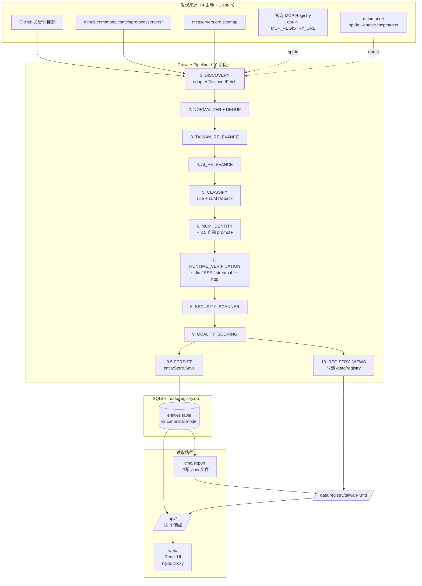

<div align="center">

[English](README.md) | [繁體中文](README.zh-TW.md) | [简体中文](README.zh-CN.md)

</div>

# Taiwan AI Ecosystem Registry

自动化爬虫与注册表构建工具，用于发现、分类与验证与台湾相关的 AI 工具、MCP 服务器、数据集和基础架构。

## 概述

**Taiwan AI Ecosystem Registry** 从多个来源（GitHub、mcpservers.org、官方 MCP registry）爬取 AI 相关实体，包括 MCP 服务器、AI agents、数据集、SDK 和基础架构，筛选出与台湾相关的项目。每个实体走完 10 阶段 pipeline（Discovery → Normalize → Taiwan/AI 相关性 → Classify → MCP Identity → Runtime Verify → Security Scan → Quality Score → Persist → Export），最终结果通过 REST API 与 React 网页 UI 提供查询。

系统范围刻意不仅限于 MCP：MCP 是约 20 种 `PrimaryClassification` 之一（其他包括 `AI_AGENT`、`AI_TOOL`、`AI_DATASET`、`AI_TUTORIAL`、`MCP_COLLECTION`、`DATA_LIBRARY` 等）。Spec §60 / §63 核心原则：

```text
DISCOVER BROADLY → CLASSIFY EXPLICITLY → VERIFY OBJECTIVELY → PUBLISH CONSERVATIVELY
```

`"MCP mentioned"` ≠ `"MCP used"` ≠ `"MCP client"` ≠ `"MCP server"` ≠ `"Verified MCP server"`。这些是数据模型中各自独立的状态。

## 功能

- **多来源发现** — 4 个主动来源（`github`、`github-repo:modelcontextprotocol/servers*`、`registry` [opt-in]、`mcpserversorg`）；`mcpmarket` 因上游 Vercel WAF 改为 opt-in（T105）
- **GitHub 两阶段关键词策略** — 默认 25 个 Taiwan+AI 广义查询；`--include-mcp-anchored` 加 7 个 MCP-anchored 查询（T101）
- **HTTP retry 处理** — 所有来源将 HTTP client 包入 `internal/retry.RetryableClient`，指数退避（mcpserversorg：3s 起始、2 并行）
- **5 个 MCP identity 状态** — `CANDIDATE → STATIC_VERIFIED → RUNTIME_VERIFIED → VERIFIED` 加独立的 `NOT_MCP` 终态（T102）
- **SSE 与 streamable-http runtime handshake** — T100 实现真实 MCP initialize + tools/list；stdio 走 subprocess
- **Data Library 防误判** — Priority -0.5 规则，防止 `twmarketdata`/`tw-quant-db` 类型项目被误升为 `MCP_SERVER`（T111，spec §22/§23/§48）
- **每笔分类决策附 evidence** — 包含 `Source`/`File`/`Snippet` 字段（T109）
- **Spec §27 evidence 加权** + 三条 hard rule helper（T110）
- **LLM fallback** — `--enable-llm-classifier`（默认开启）会在设置 `OPENAI_API_KEY` 时挂上 LLM 分类器；rule + LLM 置信度都流过同一条路径（T108）
- **REST API** — 10 个端点（见 [API](#api-参考)）
- **网页 UI** — Dashboard 含统计 + markdown view 渲染；Server list 含分类徽章
- **Seed 工具** — `cmd/seed` 将 `registry/registry.json` 灌入 v2 entities table，本地开发不用跑完整 crawler

## 架构



### 重要模块

| 路径 | 用途 |
|---|---|
| `cmd/crawler` | CLI：discover, classify, verify, scan, score, migrate, export, run |
| `cmd/api` | REST 服务器（port 8003） |
| `cmd/export` | 从 DB 独立产生 view 的工具 |
| `cmd/migrate` | V1 → V2 schema 迁移（dev 环境 DB 没 v1 table 没实跑过） |
| `cmd/seed` | 一次性 seed：`registry/registry.json` → v2 entities |
| `internal/coordinator` | 10 阶段 pipeline 编排 |
| `internal/engines` | rule + LLM 分类器、MCP identity、runtime verifier、quality engine、security scanner、endpoint classifier |
| `internal/sources/{github,githubrepo,registry,mcpserversorg,mcpmarket}` | 每个外部来源一个 adapter |
| `internal/storage` | SQLite v2 store（`entities` table） |
| `internal/export` | view 产生器（10 个 `taiwan-*.md` + `.json` 文件） |
| `internal/api` | REST handlers |
| `web/` | React 19 + Vite + nginx |

## 系统需求

- **Go 1.25+**（`go.mod` 声明 `go 1.25.0`；用 1.27 测试）
- **Node 20+** 与 **pnpm 9+**（网页 UI 用）
- **Docker** with BuildKit（web build 是 multi-stage）
- **`GITHUB_TOKEN`** 建议设置（匿名 60/h，有 token 5000/h）
- **`OPENAI_API_KEY`** optional；会启用 LLM fallback 应付 ambiguous entity
- **磁盘空间**：Docker image 约 2 GB，`data/registry.db` + `registry/` view 约 50 MB

## 安装

```bash
# Clone
git clone <repository-url> awesome-taiwan-ai-ecosystem
cd awesome-taiwan-ai-ecosystem

# 编译 Go binary 到 bin/
make build
# 产出 bin/crawler bin/api bin/exporter bin/migrator

# 安装 web 依赖
cd web && pnpm install && pnpm build && cd ..
```

或用 Docker 全部编译：

```bash
docker compose build
```

## 配置

所有变量从环境读取。`docker-compose.yaml` 把 crawler 容器的变量默认为空，这样 `docker compose up` 直接跑就是 anonymous GitHub + 停用 registry/mcpmarket。

| 变量 | 默认 | 使用者 | 说明 |
|---|---|---|---|
| `GITHUB_TOKEN` | 空 | `crawler`, `api` | 设置后提高 rate limit |
| `OPENAI_API_KEY` | 空 | `crawler` | 启用 LLM 分类 fallback |
| `OPENAI_BASE_URL` | `https://opencode.ai/zen/v1` | `crawler` | OpenAI 兼容 chat completions URL |
| `OPENAI_MODEL` | 空 | `crawler` | 单一模型名称；默认 fallback chain 为 `gpt-4o-mini → gpt-4o` |
| `MCP_REGISTRY_URL` | 空（source 停用） | `crawler` | 真正的官方 MCP registry URL；opt-in 才启用，避免打 placeholder `api.mcp-servers.dev` |
| `VITE_API_URL` | `http://api:8003/api/v1` | `web` build | build time 注入 |

crawler 较常用的 CLI flag（完整列表 `crawler --help`）：

| Flag | 默认 | 效果 |
|---|---|---|
| `--db` | `./data/registry.db` | SQLite 路径 |
| `--source` | `all` | `github` / `registry` / `mcpserversorg` / `mcpmarket` / `all` |
| `--pipeline` | `full` | `full` / `discovery-only` / `classify-only` / `verify-only` |
| `--include-mcp-anchored` | `false` | 加 7 个 MCP-anchored 查询到 GitHub 搜索 |
| `--enable-mcpmarket` | `false` | 启用 mcpmarket（Vercel WAF 上游） |
| `--enable-llm-classifier` | `true` | 关掉 = 纯 rule-based |
| `--workers` | `4` | 每个来源的并行度 |
| `--malicious-threshold` | `MEDIUM` | `LOW` / `MEDIUM` / `HIGH` / `CRITICAL` |

## 快速开始

刚 clone 完想最快看到数据库有东西：

```bash
# 1. 把 561 笔 legacy 灌进 v2 entities table
#    跳过 long crawler run，可以直接测 API + view 产生器
go run ./cmd/seed --db data/registry.db --limit 561

# 2. 产生 view 文件到 ./registry/
docker compose run --rm crawler export --db /data/db/registry.db

# 3. 编译并启动 API + web
docker compose build
docker compose up -d api web

# 4. 打开
open http://localhost:3000      # 网页 UI
curl http://localhost:3000/api/v1/health   # 200, db_count: 561
```

要跑完整 crawler（用真实网络，较慢）：

```bash
docker compose up -d crawler   # 跑 10 阶段 pipeline；log 看 docker logs
```

完整跑一轮要 30-60+ 分钟，因为每个 source 的退避（mcpserversorg 经 slug 预过滤后剩 1455 个 candidate，每个走 retry client 序列取）。

## API 参考

全部端点都是 GET。网页 UI 通过 nginx 将 `/api/*` 代理到 api 容器。

| 端点 | 说明 | 返回 |
|---|---|---|
| `GET /health` | 存活 | `{status, timestamp, version, db_count}` |
| `GET /api/v1` | API 索引 | 端点列表 |
| `GET /api/v1/health` | 同 `/health` | （v1 namespace 重复路径） |
| `GET /api/v1/entities` | Entity 列表（v2 canonical） | `{entities: [...], pagination: {...}}` — 默认 `MinTaiwanLevel=T1`，加 `?all=true` 看全部 561 |
| `GET /api/v1/entities?level=T3` | 按 Taiwan level 过滤 | 同形 |
| `GET /api/v1/entities?category=AI_AGENT` | 按 primary 分类过滤 | 同形 |
| `GET /api/v1/servers` | Legacy MCP_SERVER view（向后兼容） | `{servers: [...], pagination: {...}}` — 只有 `MCP_SERVER` + `RuntimeVerified`（dev 环境目前空） |
| `GET /api/v1/servers/{id}` | 单笔 server by ID | `{server: ...}` |
| `GET /api/v1/search` | 全文搜索 | `{query, results: [...], pagination: {...}}` |
| `GET /api/v1/registry` | 完整 registry v0.1 形状（向后兼容） | `{schema_version, statistics, servers: [...]}` |
| `GET /api/v1/registry/markdown` | 列出可用 view 文件 | `{files: ["taiwan-ai-ecosystem.md", ...]}` |
| `GET /api/v1/registry/markdown?file=taiwan-ai-ecosystem.md` | 单一 view 文件 | 原始 `text/markdown` |
| `GET /api/v1/registry/index` | 跨文件总表（Dashboard 索引表） | `{total_entities, view_count, views: [{slug, name, description, group, count, filename}]}` |
| `GET /api/v1/statistics` | 按 level / health / quality / status / classification 计数 | `{total_servers, taiwan_relevant, by_level, by_health, quality_distribution, by_status, by_classification}` — T1+ 过滤 |

### 分页

list 端点的 `page`（默认 `1`）与 `limit`（默认 `50`，max `1000`）。

## 数据模型

v2 entity（`internal/models/entity.go` 的 `Entity` struct）对应 spec §37 canonical schema：

```yaml
id: string                       # sha256 hex of canonical identity
name, slug, description: string
classification:
  primary: PrimaryClassification # MCP_SERVER / AI_AGENT / AI_TOOL / AI_DATASET / ...
  secondary: []string
  confidence: 0-100
taiwan_relevance: { score, level (T0..T5), evidence, confidence }
ai_relevance: { score, level, evidence, confidence }
mcp_identity:
  related: bool
  status: CANDIDATE | STATIC_VERIFIED | RUNTIME_VERIFIED | VERIFIED | NOT_MCP
  role: SERVER | CLIENT | HOST | SDK | LIBRARY | ...
  confidence: 0-100
  static_checked_at, runtime_verified_at: timestamp
endpoints: [{ url, transport, type, verified }]  # type per spec §24
repository: { url, owner, name, stars, language, topics, ... }
quality: { score, grade (A-F), components (10), evidence }
security: { status (CLEAN/SUSPICIOUS/QUARANTINED/BLOCKED), findings }
sources: [{ primary, source, url, trust_score }]   # primary flag 在 T104 加
entity_status: DISCOVERED | CLASSIFIED | VERIFIED | REJECTED | QUARANTINED
```

JSON schema 对应 `schema/entity.json` 与 `schema/registry.json`（T106，v2.0）。

## 发现来源

| 来源 | 信任分 | 状态 | 备注 |
|---|---|---|---|
| `github` | 0.95 | active | 两阶段关键词（T101）：25 广义 + 7 MCP-anchored（opt-in） |
| `github-repo:modelcontextprotocol/servers` | 0.95 | active | 抓官方 MCP servers 列表 |
| `github-repo:modelcontextprotocol/servers-archived` | 0.95 | active | 抓 archived 条目 |
| `mcpserversorg` | 0.7 | active | Slug 预过滤（T107）从 10182 砍到 1455 candidate |
| `registry` | 0.9 | **opt-in**（T103） | 原写死 `https://api.mcp-servers.dev`（DNS 失败）。设置 `MCP_REGISTRY_URL` 才启用 |
| `mcpmarket` | 0.7 | **opt-in**（T105） | 背后 Vercel WAF；默认停用，`--enable-mcpmarket` 启用 |

## 配置文件

| 文件 | 用途 |
|---|---|
| `config/pipeline.yaml` | pipeline 配置（mode、timeouts、filters）— 目前是信息性；Go code 读 CLI flag |
| `config/sources.yaml` | 来源清单（placeholder；Go code 用 `cmd/crawler/main.go` 写死的来源清单） |
| `config/taiwan_signals.yaml` | Taiwan 相关性关键词字典 |
| `config/ai_signals.yaml` | AI 相关性关键词字典 |
| `config/categories.yaml` | 分类 enum |
| `config/domains.yaml` | Taiwan 官方 domain 列表 |

## 输出：Registry Views

view 产生器（`internal/export/view_generator.go`）写 10 个 markdown + 10 个 JSON 文件到 `/data/registry/`。每个是 entity 集合的不同过滤（见 spec §44 / §60）。

| 文件 | 过滤 | seed 数量（561 笔） |
|---|---|---|
| `taiwan-ai-ecosystem.md` | T1+ Taiwan relevant、全部 primary 分类 | 200 |
| `taiwan-mcp.md` | `MCP_SERVER` + `MCP_VERIFIED` + T1+ + not blocked | 0（seed 路径没有 entity 到 VERIFIED） |
| `taiwan-mcp-candidates.md` | `MCP_SERVER` + `STATIC_VERIFIED` 或 `CANDIDATE` | 415 |
| `taiwan-ai-agents.md` | `AI_AGENT` | 16 |
| `taiwan-ai-tools.md` | `AI_TOOL` / `AI_SDK` / `AI_FRAMEWORK` / `AI_PLUGIN` | 5 |
| `taiwan-ai-data.md` | `AI_DATASET` / `DATA_LIBRARY` / `AI_KNOWLEDGE_BASE` | 12 |
| `taiwan-ai-skills.md` | `MCP_SKILL` / `AI_SKILL` | 0 |
| `taiwan-ai-infrastructure.md` | `AI_INFRASTRUCTURE` | 0 |
| `taiwan-ai-tutorials.md` | `AI_TUTORIAL` / `AI_EXAMPLE` / `TUTORIAL` | 7 |
| `taiwan-ai-collections.md` | `MCP_COLLECTION` / `AI_COLLECTION` / `COLLECTION` | 19 |
| `awesome-taiwan-mcp.md` | Legacy 向后兼容 view（MCP only） | 视情况 |
| `malicious/MALICIOUS_REPORT.md` + `blocklist.txt` | 安全扫描输出 | 每次 export 都产 |
| `security/injection/INJECTION_REPORT.md` + `patterns.json` | Prompt-injection 扫描输出 | 每次 export 都产 |

上表数字来自一次 seed（561 笔 legacy）。换不同 dataset 会变。随时可用 `GET /api/v1/registry/index` 拿 live count（Dashboard 把它渲染成可点击的索引表）。

## 错误处理

- **Crawler** 阶段记录每笔 entity 失败（`fetch_error`、`save_failed` 等）并继续。pipeline 只在第一个 fatal 阶段（DB 无法连接等）返回错误；个别坏 record 不会中止整个 batch。
- **API** 用结构化 JSON 错误响应：`{error, message}`。验证错误 400、找不到资源 404、DB 错误 500。Go 1.22+ method-aware `mux.HandleFunc("GET ...")` pattern 表示 `/api/v1` 只 match 精确路径；像 `/api/v1/entities` 走自己的 handler（修掉建 markdown viewer 时发现的 prefix-collision bug）。
- **Runtime verifier** 区分 `PASSED` / `FAILED` / `ERROR`。SSE 与 streamable-http 用真实 `http.Client.Do`；stdio spawn subprocess 通过 pipe 送 JSON-RPC。`mcpserversorg` adapter 内 8xx retry 退避上限 30s。

## 日志与监控

`internal/metrics/logger.go` 对每个阶段转换输出结构化 `time=... level=INFO|WARN|ERROR msg=... crawl_id=... stage=... event=...`。crawler 容器直接 pipe 到 `docker logs ai-ecosystem-crawler`。典型 run 会看到：

```
level=INFO msg=source_started crawl_id=20260907T120924Z stage=DISCOVERY source=mcpserversorg
level=INFO msg=source_complete crawl_id=20260907T120924Z stage=DISCOVERY source=mcpserversorg candidates_found=1455
level=INFO msg=PERSIST save_complete saved=200 failed=0 total=200
level=INFO msg=REGISTRY_VIEWS complete entities=200
```

**没有 metrics 端点**（Prometheus、OpenTelemetry），**没有 log aggregation**。

## 测试

```bash
# 全部 Go 测试（~2 分钟）
make test

# Acceptance 测试（spec §56，14 case）
make test-acceptance

# FP rate（spec §58 — 必须 < 5% PASS，< 2% EXCELLENT）
go test ./internal/engines -run TestFPRate -v -count=1

# Web 单元测试
cd web && pnpm test
```

**没测量 coverage**，没设目标。`tests/fixtures/ground_truth/` 150 个 ground truth fixture（50 positive + 100 negatives）驱动 FP rate 测试。

## 编译

```bash
make build              # 4 个 binary 全部到 bin/
make build-crawler     # 单个 binary
make docker-build      # 编译所有 Docker image
make docker-compose-up # 启动整个 stack
```

Multi-stage Dockerfile（`Dockerfile.multi`）：

- `runtime-crawler` — 单 binary + ca-certificates
- `runtime-api` — 同上但跑 `api` 不是 `crawler`
- `web` — node:22-alpine 编译 → nginx:alpine 跑

## 部署

`docker-compose.yaml` 是部署形状。三个 service：`crawler`、`api`、`web`。crawler 资源限制：1.0 CPU、512 MB。`api` 与 `web` 是 read-only root fs + `tmpfs: /tmp`。这些都还没到 production 标准 — 把 compose 当 dev 部署。

[NEEDS VERIFICATION] Production 部署形状（Kubernetes manifest、Terraform、secret 管理、TLS、log shipping）— repo 没提供。

## 安全性

- Container 跑 `no-new-privileges` + `read_only: true` root fs
- `GITHUB_TOKEN` / `OPENAI_API_KEY` 从环境读，**永不写进 DB**
- 阶段 8 安全扫描（T080）产出 `malicious/MALICIOUS_REPORT.md` + `security/injection/INJECTION_REPORT.md`，默认 `MEDIUM` threshold
- Prompt-injection 模式扫 entity metadata（OWASP MCP top-10 patterns，T097 P1-2）
- Web SPA 不持有 secret；auth 委由未实作的 [NEEDS VERIFICATION] auth provider

## 限制

- **`taiwan-mcp.md` 在 seed 路径永远 0**：legacy `registry/registry.json` 没有任何 entity 有 `MCPIdentity.Status == RUNTIME_VERIFIED`。Runtime verifier（T100）有 unit test 对 mock server 验证过，但 CI 还没对真实 MCP server 跑过。要让这个 view 有 entity，需真实 crawler 走 GitHub source → SSE/streamable-http handshake。
- **`migrate` CLI 没用** — DB 已经没 v1 `mcp_servers` table 给它迁移。V1→V2 code 还在，但 crawler pipeline 接上时数据已经是 v2。
- **API 没认证** — 全部端点都是匿名。Web UI 通过 nginx proxy 跟 api 讲话，没 auth。要公开部署，请放自己的 reverse proxy 认证。
- **没有后台调度** — crawler container 跑一次 `crawler run` 就结束。cron / Kubernetes CronJob / systemd timer 是 operator 的责任。
- **单进程 crawler** — 每个 source 4 workers 是唯一的并行模式。没实现可横向扩展的分散爬取。
- **没有持久化 job 状态** — `migrate` CLI 有 checkpoint table 支持 resume，但主 crawler 没有。中断的话下次从头跑。
- **Spec §44 列 5 个 view；实现产 10 个**。实现比 spec §60 Expected Result 树状图更完整。如果只要 spec §44 子集，过滤 `cmd/export/main.go` 与 `internal/export/view_generator.go` 的 view list。
- **启发式 seed 分类** — `cmd/seed` 用关键词启发式（T-e33156e）给 legacy record 分配 `MCP_SERVER` / `AI_AGENT` / `AI_DATASET` 等。保守但不完美；~5-15% record 可能误分。要 override，跑完整 classifier pipeline。
- **`registry/REGISTRY.md` 是 legacy v0.1 输出** 从 2026-09-05。新 view 文件（`taiwan-ai-*.md`）在同目录并存。

## 开发指南

```
.
├── cmd/              # 五个 binary：crawler, api, export, migrate, seed
├── internal/
│   ├── api/          # REST handlers
│   ├── classify/     # legacy rule-based 分类器（向后兼容）
│   ├── coordinator/  # 10 阶段 pipeline
│   ├── engines/      # classifier, mcp_identity, runtime_verifier, security_scanner, quality_engine, llm_classifier
│   ├── sources/      # 每个外部来源一个 adapter
│   ├── storage/      # SQLite v2 store
│   ├── export/       # view 产生器
│   ├── models/       # canonical Entity struct（spec §37）
│   ├── config/       # YAML loader
│   ├── retry/        # HTTP retry client with backoff
│   └── ...           # dedupe, evidence, manifest, metrics, normalize, observability, scoring, search, security, verify
├── config/           # YAML 字典（taiwan, ai, categories, domains）
├── schema/           # entity.json（v2.0）+ registry.json（v2.0 wrapper）
├── migrations/       # V1 SQL migrations（保留供参考；v2 store 内嵌在 binary）
├── tests/            # unit + integration tests；FP rate 的 ground truth fixture
├── web/              # React 19 + Vite；nginx.conf 将 /api/ 代理到 api 容器
├── registry/         # 产生的 view 输出（dev seed 已 commit）
├── docs/             # (placeholder)
├── docker-compose.yaml
├── Dockerfile
└── Dockerfile.multi  # multi-stage：runtime-crawler, runtime-api, web
```

## 贡献

[NEEDS VERIFICATION] 贡献指南、code review、CI 配置 — repo 没提供。请先开 issue。

## 授权

本專案採 **Apache License 2.0** 授權。詳見 [`LICENSE`](LICENSE)。

## 文件

- 规格书：`~/tasks/awesome-taiwan-ai-ecosystem/TAIWAN_AI_ECOSYSTEM_REGISTRY_SPEC.md`（v1.0，65 个区段，12 个 phase）
- 算法细节：`~/tasks/awesome-taiwan-ai-ecosystem/algs/*.md`（10 个算法文件）
- 每个任务的计划与执行记录：`~/tasks/awesome-taiwan-ai-ecosystem/tasks/T097–T111.md`
- 审计记录：`audit-markdown.md`
