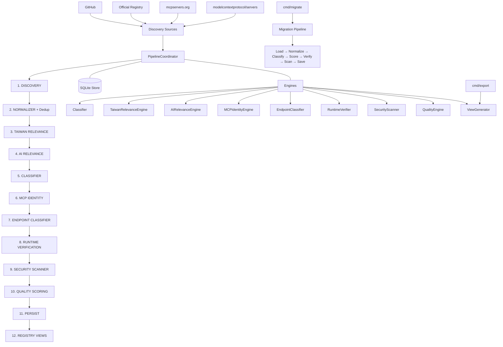

<div align="center">

[English](README.md) | [繁體中文](README.zh-TW.md) | [简体中文](README.zh-CN.md)

</div>

# Taiwan AI Ecosystem Registry

自動化爬蟲與註冊表建立工具，用於發現、分析和驗證與台灣相關的 AI 工具、MCP 伺服器、資料集和基礎架構。

## 概述

**Taiwan AI Ecosystem Registry** 從多個來源（GitHub、官方註冊表、社群平台）爬取 AI 相關實體，包括 MCP 伺服器、AI 工具、資料集、SDK 和基礎架構等，篩選出與台灣相關的項目。爬蟲會進行標準化、去重、分類、驗證、安全掃描、品質評分，並匯出標準化的註冊表。

透過關鍵字匹配、官方網域（如 `.gov.tw`、`.org.tw`）、政府 API、金融 API（TWSE、TPEx）、不動產資料，以及繁體中文語言偵測來識別台灣相關的實體。

**Pipeline:** Discovery → Normalize → Taiwan Relevance → AI Relevance → Classify → MCP Identity → Runtime Verify → Security Scan → Quality Score → Persist → Export

### 核心原則

- **Discovery Broadly**：從多個來源廣泛發現候選實體
- **Classify Explicitly**：應用確定性與 LLM 分類規則對實體進行分類
- **Verify Objectively**：執行階段驗證與安全掃描，提供客觀品質信號
- **Publish Conservatively**：只有品質良好且驗證通過的實體才會放入已發布註冊表

### 架構原則

```text
DISCOVER BROADLY
      ↓
CLASSIFY EXPLICITLY
      ↓
VERIFY OBJECTIVELY
      ↓
PUBLISH CONSERVATIVELY
```

MCP 是**分類類別**，而不是發現的邊界。系統從 AI 生態系統廣泛發現，並對每個實體進行明確分類。「提及 MCP」 ≠「使用 MCP」 ≠「MCP 客戶端」 ≠「MCP 伺服器」 ≠「驗證通過的 MCP 伺服器」。這些是獨立的狀態，在資料模型中保持分離（規格 §63）。

## 支援的實體類型

分類器支援以下主要分類（規格 §11）：

| 分類 | 主要分類 |
|---|---|
| **MCP** | `MCP_SERVER`, `MCP_CLIENT`, `MCP_HOST`, `MCP_SDK`, `MCP_LIBRARY`, `MCP_EXTENSION`, `MCP_SKILL`, `MCP_COLLECTION` |
| **AI** | `AI_AGENT`, `AI_APPLICATION`, `AI_TOOL`, `AI_SDK`, `AI_FRAMEWORK`, `AI_SKILL`, `AI_KNOWLEDGE_BASE`, `AI_DATASET`, `AI_API`, `AI_INFRASTRUCTURE`, `AI_PLUGIN`, `AI_TUTORIAL`, `AI_EXAMPLE`, `AI_COLLECTION`, `AI_REGISTRY` |
| **其他** | `DATA_LIBRARY`, `DATASET`, `API`, `CLI`, `WEB_APPLICATION`, `DATABASE`, `RESEARCH`, `TUTORIAL`, `COLLECTION`, `OTHER`, `NOT_AI_PROJECT`, `UNKNOWN` |

## 註冊表視圖

Pipeline 會產生多個註冊表視圖供不同消費者使用（規格 §44, §53）：

| 視圖 | 說明 |
|---|---|
| `taiwan-ai-ecosystem.md` / `.json` | 所有台灣 AI 生態系統實體 (T1+) |
| `taiwan-mcp.md` / `.json` | 驗證通過的 MCP 伺服器 (Runtime Verified, T1+, 未被安全封鎖) |
| `taiwan-mcp-candidates.md` / `.json` | MCP 伺服器候選 (Candidate, Static Verified) |
| `taiwan-ai-agents.md` / `.json` | 台灣 AI 代理 |
| `taiwan-ai-tools.md` / `.json` | 台灣 AI 工具、SDK、框架、插件 |
| `taiwan-ai-data.md` / `.json` | 台灣 AI 資料集、資料庫、API |
| `taiwan-ai-skills.md` / `.json` | AI/MCP 技能 |
| `taiwan-ai-infrastructure.md` / `.json` | AI 基礎架構 |
| `taiwan-ai-tutorials.md` / `.md` | 教學與範例 |
| `taiwan-ai-collections.md` / `.json` | 收集與註冊表 |
| `awesome-taiwan-mcp.md` | 傳統 MCP 專用視圖 (向後兼容，見規格 §53) |

## 架構



`PipelineCoordinator` (`internal/coordinator/coordinator.go`) 協調 10 個有序階段。每個階段都是獨立的（規格 §45）：台灣相關性、AI 相關性、MCP 身分、執行階段驗證、安全狀態和品質分數都是獨立計算的，永遠不會合併為單一分數。

獨立的 **Migration CLI** (`cmd/migrate/main.go`) 重新處理現有資料庫記錄，執行完整的分類 Pipeline。獨立的 **Export CLI** (`cmd/export/main.go`) 從資料庫讀取並呼叫 ViewGenerator。

## 專案結構

```
├── cmd/
│   ├── crawler/              # 主要 CLI 進入點 (cobra)
│   │   └── main.go           # 指令: run, crawl, discover, classify, verify, scan,
│   │                         #   score, migrate, export, search, stats, version
│   ├── migrate/              # 獨立遷移 CLI
│   │   └── main.go           # 完整 Pipeline: load→normalize→classify→score→verify→scan→save
│   └── export/               # 獨立匯出工具
│       └── main.go           # 從資料庫讀取，呼叫 ViewGenerator
├── internal/
│   ├── classify/             # 台灣相關性分類 (關鍵字、LLM、規則)
│   ├── config/               # 信號配置 (taiwan_signals.yaml, ai_signals.yaml)
│   ├── coordinator/          # 新版 Pipeline 協調
│   │   ├── coordinator.go    # PipelineCoordinator (10-stage pipeline)
│   │   └── stages.go         # Stage interface + Pipeline struct
│   ├── crawler/              # 傳統爬蟲 Pipeline
│   │   ├── coordinator.go    # CrawlCoordinator
│   │   ├── incremental.go    # IncrementalCrawler
│   │   └── run/              # 爬蟲運行管理
│   ├── dedupe/               # 去重引擎 (正規化身份)
│   ├── engines/              # 分類與驗證引擎
│   │   ├── classifier.go     # 實體分類 (25 個主要類型)
│   │   ├── taiwan_relevance.go # 台灣相關性引擎 (規格 §17)
│   │   ├── ai_relevance.go   # AI 相關性引擎 (規格 §10)
│   │   ├── mcp_identity.go    # MCP 身分偵測引擎
│   │   ├── endpoint_classifier.go # 端點 URL 類型分類
│   │   ├── runtime_verifier.go # MCP 協定握手驗證
│   │   ├── security_scanner.go # 安全掃描 (6 個檢測類別)
│   │   ├── quality_engine.go  # 品質評分 (10 組件, 0-100)
│   │   ├── acceptance_test.go  # 接受測試 (規格 §56, 12 個測試)
│   │   └── fp_rate_test.go    # 假陽性率測試 (規格 §58)
│   ├── evidence/             # 證據收集
│   ├── export/               # 視圖生成與匯出
│   │   ├── view_generator.go # RegistryView 生成 (9 個視圖 + 傳統)
│   │   └── exporter.go       # 傳統 Markdown 匯出
│   ├── health/               # 端點健康檢查
│   ├── manifest/             # MCP manifest 解析
│   ├── metrics/              # 結構化 JSON 日誌
│   ├── models/               # 資料模型
│   │   ├── entity.go         # Entity struct、枚舉、生命周期方法
│   │   ├── classification.go # PrimaryClassification 枚舉 (25 類型)、MCPRole
│   │   └── models.go         # 傳統 MCPServer、Status、HealthStatus 等
│   ├── normalize/            # 正規化 (RawRecord → MCPServer)
│   ├── sources/              # 資料源 adapters
│   │   ├── github/           # GitHub 倉庫搜尋/發現
│   │   ├── githubrepo/       # GitHub 目錄型 (modelcontextprotocol/servers)
│   │   ├── registry/         # 官方 MCP 註冊表
│   │   ├── mcpserversorg/    # mcpservers.org (Sitemap + goquery)
│   │   └── mcpmarket/        # mcpmarket.com
│   ├── storage/              # SQLite 持久化
│   │   ├── store.go          # 傳統 MCPServer 存儲
│   │   ├── entity_store.go   # 新 Entity 存儲 (schema_v2)
│   │   ├── schema_v2.sql     # 新 entities schema
│   │   └── migrations.go     # V1→V2 遷移邏輯
│   └── verify/               # 倉庫 + MCP 協定驗證
├── config/
│   ├── pipeline.yaml         # Pipeline 階段配置
│   ├── taiwan_signals.yaml   # 台灣信號關鍵字
│   ├── ai_signals.yaml       # AI 信號關鍵字
│   ├── keywords.yaml         # 發現查詢關鍵字
│   └── domains.yaml          # 官方台灣網域
├── tests/
│   ├── fixtures/
│   │   ├── acceptance/       # 接受測試固件 (含 MCP 測試伺服器)
│   │   ├── golden/           # Golden regression 測試資料
│   │   └── ground_truth/     # FP rate 測試真值 (50 正例, 100 反例)
│   ├── integration/          # E2E Pipeline 測試
│   ├── unit/                 # 單元 + golden regression 測試
│   └── benchmarks/           # 效能基準測試
├── migrations/               # 資料庫遷移文件
├── Dockerfile                # 多階段建構: golang:1.26-alpine → alpine:latest
├── docker-compose.yaml       # crawler 服務
└── .golangci.yml             # linter 配置
```

## 需求

- **Go** 1.25+
- **GITHUB_TOKEN** — 用於 GitHub API 搜尋與抓取
- **OPENAI_API_KEY** — (選填) 用於模糊候選的 LLM 分類
- **OPENAI_BASE_URL** — (選填) OpenAI-compatible API 端點
- **Docker** — 用於容器建構

## 安裝

### 從原始碼建構

```bash
# 建構所有 CLI
go build -o crawler ./cmd/crawler
go build -o migrator ./cmd/migrate
go build -o exporter ./cmd/export
```

### Docker

```bash
docker build -t awesome-taiwan-ai-ecosystem .
```

## 配置

| 環境變數 | 必填 | 預設 | 說明 |
|---|---|---|---|
| `GITHUB_TOKEN` | 是 | — | GitHub API Token，用於倉庫搜尋與抓取 |
| `OPENAI_API_KEY` | 否 | — | OpenAI-compatible API Key，用於 LLM 分類 |
| `OPENAI_BASE_URL` | 否 | `https://opencreate.ai/zen/v1` | OpenAI-compatible API 基礎 URL |
| `OPENAI_MODEL` | 否 | — | 僅覆寫 **當前爬蟲實例** 的模型 |

CLI 標誌：

| 標誌 | 預設 | 說明 |
|---|---|---|
| `--source` | `all` | 要爬取的資料源: `github`, `registry`, `mcpserversorg`, `mcpmarket`, 或 `all` |
| `--workers` | `4` | 每個資料源的 worker 數量 |
| `--max-per-source` | `10` | 每個資料源的最大候選數量 (0 = 無限制) |
| `--incremental` | `false` | 執行增量爬取 (僅重新爬取有變更的候選) |
| `--full` | `false` | 強制完整爬取 |
| `--db` | `./data/registry.db` | SQLite 資料庫路徑 |
| `--config` | `config/sources.yaml` | 配置文件路徑 |
| `--markdown` | `false` | 生成人類可讀 Markdown (export 子指令) |
| `--capability` | — | 以 capability 關鍵字搜尋 (search 子指令) |
| `--min-score` | `0` | 最小品質分數過濾 |
| `--level` | — | 依台灣相關性等級過濾 (T0-T5) |
| `--category` | — | 依分類過濾 |
| `--json` | `false` | JSON 輸出格式 |
| `--dry-run` | `false` | 驗證但不寫入變更 |
| `--verbose` | `false` | 啟用詳細日誌 |

## 快速開始

```bash
# 1. 建構 CLI
go build -o crawler ./cmd/crawler
go build -o migrator ./cmd/migrate
go build -o exporter ./cmd/export

# 2. 執行完整 Pipeline
export GITHUB_TOKEN=your_github_token_here
./crawler run --source github --workers 4 --max-per-source 10

# 同時爬取 mcpservers.org (10k+ 候選透過 Sitemap)
./crawler run --source mcpserversorg --workers 2 --max-per-source 100

# 3. 執行遷移 Pipeline (重新分類現有實體)
./migrator --db ./data/registry.db --dry-run

# 4. 匯出註冊表視圖
./exporter --db ./data/registry.db --markdown

# 5. 搜尋實體
./crawler search "taiwan"
./crawler search --capability "filesystem"

# 6. 查看統計
./crawler stats
```

### CLI 指令

```bash
# 主要 CLI (cmd/crawler)
crawler run        # 完整 Pipeline: discover → normalize → classify → verify → scan → score → export
crawler crawl      # 別名: `run`
crawler discover   # 僅發現階段 (從資料源抓取)
crawler classify   # 分類 + 台灣/AI 評分 + MCP 身分
crawler verify     # 執行階段驗證 (MCP 協定握手)
crawler scan       # 安全掃描
crawler score      # 品質評分
crawler migrate    # 資料庫遷移 (V1→V2)
crawler export     # 匯出註冊表視圖 (JSON + Markdown)
crawler search     # 搜尋註冊表
crawler stats      # 查看聚合統計
crawler version    # 列印版本資訊

# 遷移 CLI (cmd/migrate) — 獨立完整 Pipeline
migrator --db ./data/registry.db --dry-run    # 乾跑 (不寫入)
migrator --db ./data/registry.db --resume     # 從檢查點恢復

# 匯出 CLI (cmd/export) — 獨立匯出工具
exporter --db ./data/registry.db --markdown   # 生成所有視圖 + Markdown
```

## 使用方法

### Run (完整 Pipeline)

```bash
# 完整 Pipeline 執行
./crawler run --source all --workers 4

# 增量執行 (僅重新爬取有變更的候選)
./crawler run --incremental --source github

# 限制每個資料源的候選數量
./crawler run --source github --max-per-source 20
```

### 個別 Pipeline 階段

```bash
# 僅發現
./crawler discover --source github --max-per-source 50

# 僅分類 (處理已在資料庫的候選)
./crawler classify --dry-run

# 執行階段驗證 (對 STATIC_VERIFIED 的伺服器)
./crawler verify

# 安全掃描
./crawler scan

# 品質評分
./crawler score
```

### 遷移

```bash
# 將現有 V1 資料庫記錄重新處理透過完整分類 Pipeline
./migrator --db ./data/registry.db --dry-run

# 恢復中斷的遷移
./migrator --db ./data/registry.db --resume

# 完整遷移 (帶資料庫寫入)
./migrator --db ./data/registry.db
```

### 匯出

```bash
# 透過獨立匯出 CLI 生成所有註冻視圖
./exporter --db ./data/registry.db --markdown

# 或使用主要 CLI
./crawler export --markdown
```

輸出檔案在 `registry/views/`：

| 檔案 | 說明 |
|---|---|
| `taiwan-ai-ecosystem.json` / `.md` | 所有台灣 AI 實體 (T1+) |
| `taiwan-mcp.json` / `.md` | 驗證通過的 MCP 伺服器 |
| `taiwan-mcp-candidates.json` / `.md` | MCP 伺服器候選 |
| `taiwan-ai-agents.json` / `.md` | 台灣 AI 代理 |
| `taiwan-ai-tools.json` / `.md` | 台灣 AI 工具、SDK、框架 |
| `taiwan-ai-data.json` / `.md` | 台灣 AI 資料集、資料庫 |
| `taiwan-ai-skills.json` / `.md` | AI/MCP 技能 |
| `taiwan-ai-infrastructure.json` / `.md` | AI 基礎架構 |
| `taiwan-ai-tutorials.json` / `.md` | 教學與範例 |
| `taiwan-ai-collections.json` / `.md` | 收集與註冊表 |
| `awesome-taiwan-mcp.md` | 傳統 MCP 專用視圖 (向後兼容) |

### 搜尋

```bash
# 文字搜尋
./crawler search "financial"
./crawler search --level T3

# Capability 搜尋
./crawler search --capability "filesystem"
./crawler search --capability "database"

# 品質過濾
./crawler search --min-score 70

# JSON 輸出
./crawler search "taiwan" --json
```

### 統計

```bash
./crawler stats
```

## 資料模型

### Entity (正規化模型 — 規格 §37, §61 Phase 1)

`Entity` 結構 (`internal/models/entity.go`) 是所有 AI 生態系統實體的正規化模型。它取代了傳統的 `MCPServer` 類型，同時透過 `ToMCPServerView()` 保持向後兼容。

| 欄位 | 類型 | 說明 |
|---|---|---|
| `id` | `string` | 正規化 repo URL 的 SHA256 |
| `name` | `string` | 顯示名稱 |
| `slug` | `string` | URL-safe slug |
| `description` | `string` | 簡短描述 |
| `entity_status` | `EntityStatus` | `DISCOVERED`, `CANDIDATE`, `VERIFIED`, `QUARANTINED`, `REJECTED` |
| `classification` | `ClassificationResult` | 主要分類 + 信心度 + 證據 + MCP 角色 |
| `taiwan_relevance` | `TaiwanRelevance` | 分數 (0-100)、等級 (T0-T5)、證據、信心度 |
| `ai_relevance` | `AIRelevance` | 分數 (0-100)、等級 (A0-A5)、證據、信心度 |
| `mcp_identity` | `MCPIdentity` | 狀態 (CANDIDATE/STATIC_VERIFIED/RUNTIME_VERIFIED/NOT_MCP)、證據、信心度、角色 |
| `endpoints` | `[]EndpointWithType` | 分類過的端點 (含類型與證據) |
| `tools` | `[]Tool` | 擷取的 MCP Tools |
| `resources` | `[]Resource` | 擷取的 MCP Resources |
| `prompts` | `[]Prompt` | 擷取的 MCP Prompts |
| `data_sources` | `[]DataSource` | 實體使用的資料來源 |
| `quality` | `QualityScore` | 分數 (0-100)、等級 (A-F)、10 組件 |
| `security_status` | `SecurityStatusDetail` | 安全掃描結果 (CLEAR/QUARANTINED/BLOCKED) |
| `runtime_verification` | `*RuntimeVerification` | MCP 協定握手結果 |
| `first_seen` / `last_seen` | `RFC3339Time` | 發現時間戳 |
| `sources` | `[]SourceReference` | 發現資料源引用 (含信任分數) |

### 實體狀態生命周期

```text
DISCOVERED → CANDIDATE → VERIFIED
                       → QUARANTINED → REJECTED
                                     → VERIFIED (誤判)
                       → REJECTED (非 AI)
VERIFIED → REJECTED (日後發現問題)
```

### 獨立維度

根據規格 §45，以下屬性是獨立計算的，永遠不會合併為單一分數：

- `taiwan_relevance`
- `ai_relevance`
- `mcp_identity`
- `runtime_verification`
- `security_status`
- `quality`

### 註冊表視圖 (規格 §44)

視圖透過過濾實體的分類 + MCP 身分生成：

- **MCP 伺服器**: `primary == MCP_SERVER` AND `identity.status == RUNTIME_VERIFIED`
- **MCP 候選**: `primary == MCP_SERVER` AND `identity.status IN (CANDIDATE, STATIC_VERIFIED)`
- **AI 代理**: `primary == AI_AGENT`
- **AI 資料**: `primary IN (DATA_LIBRARY, DATASET, AI_KNOWLEDGE_BASE)`

## 評分

### 台灣相關性 (規格 §17)

確定性評分，無需 LLM：

| 規則 | 分數 | 證據類型 |
|---|---|---|
| 官方台灣網域 (.gov.tw, .org.tw, .com.tw) | +40 | `official_domain` |
| 台灣政府 API 檢測 | +40 | `official_gov_api` |
| 台灣金融 API (TWSE, TPEx, TAIFEX, TDCC, FinMind, Fugle) | +35 | `taiwan_financial_api` |
| 台灣特定資料集檢測 | +30 | `taiwan_dataset` |
| 台灣關鍵字出現在 repo 名稱/描述 | +20 | `repository_keyword` |
| 台灣語言 (zh-TW, 繁體中文) | +15 | `taiwan_language` |
| 台灣公司/服務提及 | +15 | `taiwan_company` |
| README 提及台灣 | +5 | `readme_mention` |

等級門檻：T5 (≥70), T4 (≥55), T3 (≥40), T2 (≥20), T1 (≥5), T0 (<5)

### AI 相關性 (規格 §10)

基於以下確定性信號進行評分：倉庫 topics、描述關鍵字、套件模式、資料來源類型、工具功能。信號配置於 `config/ai_signals.yaml`。

等級門檻：A5 (≥80), A4 (≥65), A3 (≥50), A2 (≥25), A1 (≥1), A0 (<1)

### 品質評分 (規格 §31)

10 組件，總分 100 分，A-F 等級：

| 組件 | 最高分 | 依據 |
|---|---|---|
| 資料來源 | 20 | 官方台灣 API (20)、政府開放資料 (18)、公司 API (15) 等 |
| 維護 | 15 | 最後提交日期 (<90天: 15, 90-180天: 12 等) |
| 文檔 | 10 | README 存在性、長度、設置說明、範例 |
| MCP 符合度 | 15 | Manifest/config、stdio + HTTP + SSE + streamable-http 支援 |
| Tool Schema | 10 | 擁有 name + description + input schema 的 tools |
| 健康度 | 10 | 端點健康狀態 (HEALTHY: 10, DEGRADED: 5) |
| 倉庫 | 5 | 倉庫可存取 + stars |
| 授權 | 5 | 授權存在 (3)、寬鬆授權 (2) |
| 安全 | 5 | 無嚴重發現 (-5 至 +5) |
| 社群 | 5 | Stars、forks、topics |

等級: A (≥90), B (≥80), C (≥70), D (≥60), F (<60)

品質評分是**確定性的** — 相同的輸入永遠會產生相同的分數。LLM 永遠不會用於品質評分。

## 安全掃描

`SecurityScanner` (`internal/engines/security_scanner.go`) 僅執行靜態分析 —**永遠不會執行發現的程式碼** (規格 §60, algs/verification.md)。檢測類別：

| 類別 | 偵測內容 |
|---|---|
| 混淆碼 | Base64/hex 編碼載荷、`eval`、`exec`、`Function(...)` |
| credential extraction | 硬編碼 API keys、密碼、tokens (AWS、GitHub、OpenAI 模式) |
| 遠端二進位下載 | `curl\|bash`、`wget\|sh`、下載並執行模式 |
| 命令注入 | `child_process`、`os.system`、`subprocess`、未經消毒的命令執行 |
| 持續性 | Cron、systemd、啟動腳本、註冊表修改 |
| 網路信標 | 可疑 C2 域名模式、周期性網路呼叫 |
| 檔案系統濫用 | 寫入 `/etc`、`/root`、系統目錄 |
| Localhost 端點 | 指向 localhost 的 HTTP 端點 (生產環境安全風險) |

含有可疑程式碼的實體會被**隔離** (規格 §35, §56 Test 12)，並從已發布的視圖中排除。

## 執行階段驗證

`RuntimeVerifier` (`internal/engines/runtime_verifier.go`) 執行 MCP 協定握手驗證：

1. **連線** 到端點 (HTTP SSE/Streamable HTTP 或 stdio 子進程)
2. **初始化** — 發送 `initialize` 請求，期望收到有效回應 (含 `protocolVersion` 和 `capabilities`)
3. **工具列表** — 請求 `tools/list`，期望收到擁有有效名稱的 tools 陣列
4. **資源列表** — 請求 `resources/list` (若支援)
5. **提示列表** — 請求 `prompts/list` (若支援)

只有在驗證成功後，實體的 `MCPIdentity.Status` 才會進階到 `RUNTIME_VERIFIED`。

**安全限制**: MCP 協定驗證僅發送 `initialize` 和 `tools/list` 請求 — **永遠不會執行工具或發送任意負載** (規格 §26, algs/verification.md)。

## 錯誤處理

- **速率限制**: 指數退避 (1s → 2s → 4s → 8s，上限 30s，最多 3 次重試)
- **資料源降級**: 失敗的資料源會被記錄並跳過，Pipeline 繼續執行
- **LLM 失敗**: 回退到確定性分類
- **網路逾時**: 整個 Pipeline 均支援 context 取消
- **單實體隔離**: 單一實體的失敗不會阻塞其他實體

## 測試

```bash
# 所有測試
go test ./... -count=1 -timeout=120s

# 接受測試 (規格 §56: 12 個測試案例)
go test ./internal/engines/... -run TestAcceptance -v -count=1

# 假陽性率測試 (規格 §58: MCP 假陽性率 < 5%)
go test ./internal/engines/... -run TestFPRate -v -count=1

# 啟用 race 檢測
go test -race ./internal/... -count=1 -timeout=120s

# 按套件覆蓋率
go test ./... -count=1 -cover

# 整合測試
go test ./tests/integration/ -v

# CI Pipeline (等價)
go build ./... && go vet ./... && go test ./... -cover -timeout 120s
```

### 接受測試 (規格 §56)

接受測試套件 (`internal/engines/acceptance_test.go`) 覆蓋所有 12 個規格測試案例及邊界情況：

| 測試 | 場景 | 預期結果 |
|---|---|---|
| 1 | README 提及 MCP，無實現 | 非 MCP_SERVER，NOT_MCP |
| 2 | SDK 依賴但僅實現 client | MCP_CLIENT |
| 3 | 伺服器實現 (McpServer, StdioServerTransport, entry point) | MCP_SERVER |
| 4 | 執行階段驗證 (MCP 協定握手) | RUNTIME_VERIFIED |
| 5 | GitHub URL | REPOSITORY_URL (絕不為 MCP_RUNTIME_ENDPOINT) |
| 6 | 文檔 URL | DOCUMENTATION_URL |
| 7 | 安裝程式 URL | INSTALLER_URL |
| 8 | 收集庫存倉庫 | MCP_COLLECTION |
| 9 | 教學 | MCP_TUTORIAL |
| 10 | 資料 SDK | DATA_LIBRARY |
| 11 | 使用 MCP 的 AI 代理 | AI_AGENT (MCP 角色 = CLIENT) |
| 12 | 可疑程式碼 | QUARANTINED |

### 假陽性率測試 (規格 §58)

| 指標 | 數值 |
|---|---|
| 真值樣本 | 150 (50 正例, 100 反例) |
| 假陽性率 | 0.0000 |
| 精確率 | 1.0000 |
| 召回率 | 1.0000 |
| F1 分數 | 1.0000 |
| 狀態 | EXCELLENT (目標: <5%，長期: <2%) |

測試固件: `tests/fixtures/ground_truth/{positive,negative}/`

## 建構

```bash
# 標準建構
go build ./...

# Vet
go vet ./...

# 模組驗證
go mod verify

# Docker
docker build -t awesome-taiwan-ai-ecosystem .
docker compose up
```

### Docker

Dockerfile 使用多階段建構：
1. **Builder**: `golang:1.26-alpine3.24` — 編譯二進位檔
2. **Runtime**: `alpine:latest` — 以非 root 使用者執行

安全: 非 root 使用者 (uid 1000)、無特權、資源限制、唯讀檔案系統搭配 tmpfs。

```bash
docker build -t awesome-taiwan-ai-ecosystem .
docker run --rm \
  -e GITHUB_TOKEN=your_token \
  -v $(pwd)/data:/data \
  awesome-taiwan-ai-ecosystem run --db /data/registry.db
```

## 開發

```bash
# 安裝依賴
go mod download

# 執行 linter
golangci-lint run

# 格式化
gofmt -s -w .

# 執行所有測試
go test ./... -count=1 -timeout=120s

# 執行接受測試
go test ./internal/engines/... -run TestAcceptance -v -count=1

# 執行假陽性率測試
go test ./internal/engines/... -run TestFPRate -v -count=1

# 執行特定套件測試
go test ./internal/engines/ -v
```

## 已知限制

- **mcpmarket 資料源**: `mcpmarket.com` 在沙箱環境中被 Vercel WAF 擋住
- **官方註冊表**: `api.mcp-servers.dev` 在沙箱環境中可能無法解析 DNS
- **GitHub 速率限制**: 每個 token 每小時 5000 請求
- **LLM 分類器**: 需要 `OPENAI_API_KEY` 環境變數；優雅降級到確定性分類
- **增量爬取**: 使用 SQLite 中的上次爬取時間戳；需要先前的爬取資料
- **MCP 協定驗證**: 需要公開可存取的 HTTP 端點 (SSE/Streamable HTTP)；stdio 伺服器會作為子進程啟動
- **Docker compose**: 預設執行 `--help`；需要覆寫命令進行實際爬取

## 授權

本專案採用 **Apache License 2.0** 授權。詳見 [`LICENSE`](LICENSE) 檔案。
