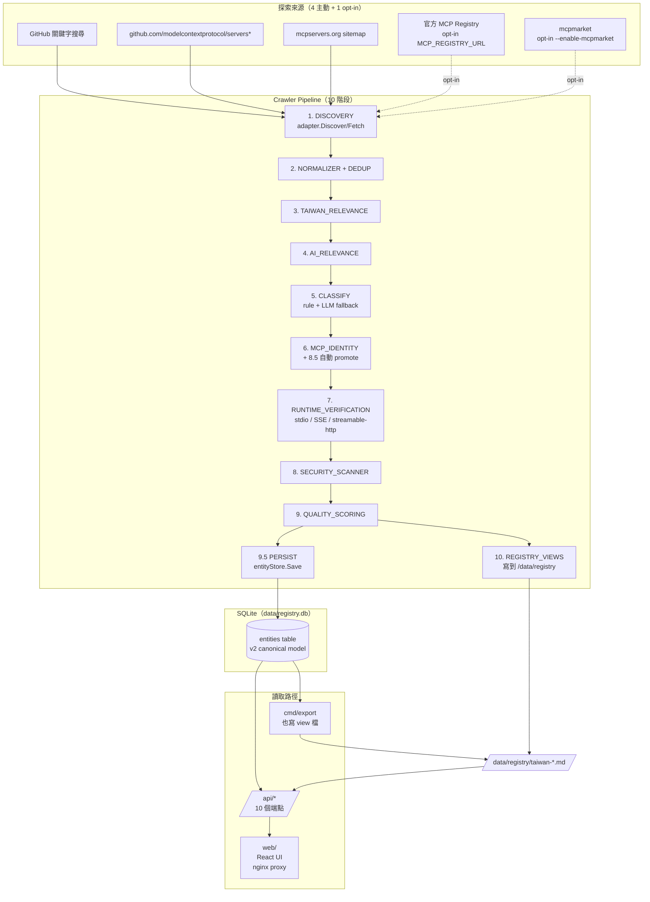

<div align="center">

[English](README.md) | [繁體中文](README.zh-TW.md) | [简体中文](README.zh-CN.md)

</div>

# Taiwan AI Ecosystem Registry

自動化爬蟲與註冊表建立工具，用於發現、分類與驗證與台灣相關的 AI 工具、MCP 伺服器、資料集和基礎架構。

## 概述

**Taiwan AI Ecosystem Registry** 從多個來源（GitHub、mcpservers.org、官方 MCP registry）爬取 AI 相關實體，包括 MCP 伺服器、AI agents、資料集、SDK 和基礎架構，篩選出台灣相關的項目。每個實體會走完 10 階段 pipeline（Discovery → Normalize → Taiwan/AI 相關性 → Classify → MCP Identity → Runtime Verify → Security Scan → Quality Score → Persist → Export），最終結果透過 REST API 與 React 網頁 UI 提供查詢。

系統範圍刻意不僅限於 MCP：MCP 是約 20 種 `PrimaryClassification` 中的一個（其他包括 `AI_AGENT`、`AI_TOOL`、`AI_DATASET`、`AI_TUTORIAL`、`MCP_COLLECTION`、`DATA_LIBRARY` 等）。Spec §60 / §63 核心原則：

```text
DISCOVER BROADLY → CLASSIFY EXPLICITLY → VERIFY OBJECTIVELY → PUBLISH CONSERVATIVELY
```

`"MCP mentioned"` ≠ `"MCP used"` ≠ `"MCP client"` ≠ `"MCP server"` ≠ `"Verified MCP server"`。這些是資料模型中各自獨立的狀態。

## 功能

- **多來源探索** — 4 個主動來源（`github`、`github-repo:modelcontextprotocol/servers*`、`registry` [opt-in]、`mcpserversorg`）；`mcpmarket` 因上游 Vercel WAF 改為 opt-in（T105）
- **GitHub 兩階段關鍵字策略** — 預設 25 個 Taiwan+AI 廣泛查詢；`--include-mcp-anchored` 加 7 個 MCP-anchored 查詢（T101）
- **HTTP retry 處理** — 所有來源把 HTTP client 包進 `internal/retry.RetryableClient`，指數退避（mcpserversorg：3s 起始、2 並行）
- **5 個 MCP identity 狀態** — `CANDIDATE → STATIC_VERIFIED → RUNTIME_VERIFIED → VERIFIED` 加獨立的 `NOT_MCP` 終態（T102）
- **SSE 與 streamable-http runtime handshake** — T100 實作真實 MCP initialize + tools/list；stdio 走 subprocess
- **Data Library 防誤判** — Priority -0.5 規則，防止 `twmarketdata`/`tw-quant-db` 類型專案被誤升為 `MCP_SERVER`（T111，spec §22/§23/§48）
- **每筆分類決策附 evidence** — 包含 `Source`/`File`/`Snippet` 欄位（T109）
- **Spec §27 evidence 加權** + 三條 hard rule helper（T110）
- **LLM fallback** — `--enable-llm-classifier`（預設開啟）會在設定 `OPENAI_API_KEY` 時掛上 LLM 分類器；rule + LLM 信心度都流過同一條路徑（T108）
- **REST API** — 10 個端點（見 [API](#api-參考)）
- **網頁 UI** — Dashboard 含統計 + markdown view 渲染；Server list 含分類徽章
- **Seed 工具** — `cmd/seed` 把 `registry/registry.json` 倒進 v2 entities table，本地開發不用跑完整 crawler

## 架構



### 重要模組

| 路徑 | 用途 |
|---|---|
| `cmd/crawler` | CLI：discover, classify, verify, scan, score, migrate, export, run |
| `cmd/api` | REST 伺服器（port 8003） |
| `cmd/export` | 從 DB 獨立產生 view 的工具 |
| `cmd/migrate` | V1 → V2 schema 遷移（dev 環境 DB 沒 v1 table 沒實跑過） |
| `cmd/seed` | 一次性 seed：`registry/registry.json` → v2 entities |
| `internal/coordinator` | 10 階段 pipeline 編排 |
| `internal/engines` | rule + LLM 分類器、MCP identity、runtime verifier、quality engine、security scanner、endpoint classifier |
| `internal/sources/{github,githubrepo,registry,mcpserversorg,mcpmarket}` | 每個外部來源一個 adapter |
| `internal/storage` | SQLite v2 store（`entities` table） |
| `internal/export` | view 產生器（10 個 `taiwan-*.md` + `.json` 檔） |
| `internal/api` | REST handlers |
| `web/` | React 19 + Vite + nginx |

## 系統需求

- **Go 1.25+**（`go.mod` 宣告 `go 1.25.0`；用 1.27 測試）
- **Node 20+** 與 **pnpm 9+**（網頁 UI 用）
- **Docker** with BuildKit（web build 是 multi-stage）
- **`GITHUB_TOKEN`** 建議設（匿名 60/h，有 token 5000/h）
- **`OPENAI_API_KEY`** optional；會啟用 LLM fallback 給 ambiguous entity
- **磁碟空間**：Docker image 約 2 GB，`data/registry.db` + `registry/` view 約 50 MB

## 安裝

```bash
# Clone
git clone <repository-url> awesome-taiwan-ai-ecosystem
cd awesome-taiwan-ai-ecosystem

# 編 Go binary 到 bin/
make build
# 產出 bin/crawler bin/api bin/exporter bin/migrator

# 裝 web 依賴
cd web && pnpm install && pnpm build && cd ..
```

或用 Docker 全部編譯：

```bash
docker compose build
```

## 設定

所有變數從環境讀取。`docker-compose.yaml` 把 crawler 容器的變數預設為空，這樣 `docker compose up` 直接跑就是 anonymous GitHub + 停用 registry/mcpmarket。

| 變數 | 預設 | 使用者 | 說明 |
|---|---|---|---|
| `GITHUB_TOKEN` | 空 | `crawler`, `api` | 設定後提高 rate limit |
| `OPENAI_API_KEY` | 空 | `crawler` | 啟用 LLM 分類 fallback |
| `OPENAI_BASE_URL` | `https://opencode.ai/zen/v1` | `crawler` | OpenAI 相容 chat completions URL |
| `OPENAI_MODEL` | 空 | `crawler` | 單一模型名稱；預設 fallback chain 為 `gpt-4o-mini → gpt-4o` |
| `MCP_REGISTRY_URL` | 空（source 停用） | `crawler` | 真正的官方 MCP registry URL；opt-in 才啟用，避免打 placeholder `api.mcp-servers.dev` |
| `VITE_API_URL` | `http://api:8003/api/v1` | `web` build | build time 注入 |

crawler 比較常用的 CLI flag（完整列表 `crawler --help`）：

| Flag | 預設 | 效果 |
|---|---|---|
| `--db` | `./data/registry.db` | SQLite 路徑 |
| `--source` | `all` | `github` / `registry` / `mcpserversorg` / `mcpmarket` / `all` |
| `--pipeline` | `full` | `full` / `discovery-only` / `classify-only` / `verify-only` |
| `--include-mcp-anchored` | `false` | 加 7 個 MCP-anchored 查詢到 GitHub 搜尋 |
| `--enable-mcpmarket` | `false` | 啟用 mcpmarket（Vercel WAF 上游） |
| `--enable-llm-classifier` | `true` | 關掉 = 純 rule-based |
| `--workers` | `4` | 每個來源的並行度 |
| `--malicious-threshold` | `MEDIUM` | `LOW` / `MEDIUM` / `HIGH` / `CRITICAL` |

## 快速開始

剛 clone 完想最快看到資料庫有東西：

```bash
# 1. 把 561 筆 legacy 倒進 v2 entities table
#    跳過長 crawler run，可以直接測 API + view 產生器
go run ./cmd/seed --db data/registry.db --limit 561

# 2. 產生 view 檔到 ./registry/
docker compose run --rm crawler export --db /data/db/registry.db

# 3. 編譯並啟動 API + web
docker compose build
docker compose up -d api web

# 4. 打開
open http://localhost:3000      # 網頁 UI
curl http://localhost:3000/api/v1/health   # 200, db_count: 561
```

要跑完整 crawler（用真實網路，較慢）：

```bash
docker compose up -d crawler   # 跑 10 階段 pipeline；log 看 docker logs
```

完整跑一輪要 30-60+ 分鐘，因為每個 source 的退避（mcpserversorg 經 slug 預過濾後剩 1455 個 candidate，每個走 retry client 序列取）。

## API 參考

全部端點都是 GET。web UI 透過 nginx 將 `/api/*` 代理到 api 容器。

| 端點 | 說明 | 回傳 |
|---|---|---|
| `GET /health` | 存活 | `{status, timestamp, version, db_count}` |
| `GET /api/v1` | API 索引 | 端點列表 |
| `GET /api/v1/health` | 同 `/health` | （v1 namespace 重複路徑） |
| `GET /api/v1/entities` | Entity 列表（v2 canonical） | `{entities: [...], pagination: {...}}` — 預設 `MinTaiwanLevel=T1`，加 `?all=true` 看全部 561 |
| `GET /api/v1/entities?level=T3` | 依 Taiwan level 過濾 | 同形 |
| `GET /api/v1/entities?category=AI_AGENT` | 依 primary 分類過濾 | 同形 |
| `GET /api/v1/servers` | Legacy MCP_SERVER view（向後相容） | `{servers: [...], pagination: {...}}` — 只有 `MCP_SERVER` + `RuntimeVerified`（dev 環境目前空） |
| `GET /api/v1/servers/{id}` | 單筆 server by ID | `{server: ...}` |
| `GET /api/v1/search` | 全文搜尋 | `{query, results: [...], pagination: {...}}` |
| `GET /api/v1/registry` | 完整 registry v0.1 形狀（向後相容） | `{schema_version, statistics, servers: [...]}` |
| `GET /api/v1/registry/markdown` | 列出可用 view 檔 | `{files: ["taiwan-ai-ecosystem.md", ...]}` |
| `GET /api/v1/registry/markdown?file=taiwan-ai-ecosystem.md` | 單一 view 檔 | 原始 `text/markdown` |
| `GET /api/v1/statistics` | 依 level / health / quality / status / classification 計數 | `{total_servers, taiwan_relevant, by_level, by_health, quality_distribution, by_status, by_classification}` — T1+ 過濾 |

### 分頁

list 端點的 `page`（預設 `1`）與 `limit`（預設 `50`，max `1000`）。

## 資料模型

v2 entity（`internal/models/entity.go` 的 `Entity` struct）對應 spec §37 canonical schema：

```yaml
id: string                       # sha256 hex of canonical identity
name, slug, description: string
classification:
  primary: PrimaryClassification # MCP_SERVER / AI_AGENT / AI_TOOL / AI_DATASET / ...
  secondary: []string
  confidence: 0-100
taiwan_relevance: { score, level (T0..T5), evidence, confidence }
ai_relevance: { score, level, evidence, confidence }
mcp_identity:
  related: bool
  status: CANDIDATE | STATIC_VERIFIED | RUNTIME_VERIFIED | VERIFIED | NOT_MCP
  role: SERVER | CLIENT | HOST | SDK | LIBRARY | ...
  confidence: 0-100
  static_checked_at, runtime_verified_at: timestamp
endpoints: [{ url, transport, type, verified }]  # type per spec §24
repository: { url, owner, name, stars, language, topics, ... }
quality: { score, grade (A-F), components (10), evidence }
security: { status (CLEAN/SUSPICIOUS/QUARANTINED/BLOCKED), findings }
sources: [{ primary, source, url, trust_score }]   # primary flag 在 T104 加
entity_status: DISCOVERED | CLASSIFIED | VERIFIED | REJECTED | QUARANTINED
```

JSON schema 對應 `schema/entity.json` 與 `schema/registry.json`（T106，v2.0）。

## 探索來源

| 來源 | 信任分 | 狀態 | 備註 |
|---|---|---|---|
| `github` | 0.95 | active | 兩階段關鍵字（T101）：25 廣泛 + 7 MCP-anchored（opt-in） |
| `github-repo:modelcontextprotocol/servers` | 0.95 | active | 抓官方 MCP servers 列表 |
| `github-repo:modelcontextprotocol/servers-archived` | 0.95 | active | 抓 archived 條目 |
| `mcpserversorg` | 0.7 | active | Slug 預過濾（T107）從 10182 砍到 1455 candidate |
| `registry` | 0.9 | **opt-in**（T103） | 原寫死 `https://api.mcp-servers.dev`（DNS 失敗）。設 `MCP_REGISTRY_URL` 才啟用 |
| `mcpmarket` | 0.7 | **opt-in**（T105） | 背後 Vercel WAF；預設停用，`--enable-mcpmarket` 啟用 |

## 設定檔

| 檔案 | 用途 |
|---|---|
| `config/pipeline.yaml` | pipeline 設定（mode、timeouts、filters）— 目前是資訊性；Go code 讀 CLI flag |
| `config/sources.yaml` | 來源清單（placeholder；Go code 用 `cmd/crawler/main.go` 寫死的來源清單） |
| `config/taiwan_signals.yaml` | Taiwan 相關性關鍵字字典 |
| `config/ai_signals.yaml` | AI 相關性關鍵字字典 |
| `config/categories.yaml` | 分類 enum |
| `config/domains.yaml` | Taiwan 官方 domain 列表 |

## 輸出：Registry Views

view 產生器（`internal/export/view_generator.go`）寫 10 個 markdown + 10 個 JSON 檔到 `/data/registry/`。每個是 entity 集合的不同過濾（見 spec §44 / §60）。

| 檔案 | 過濾 | seed 數量（561 筆） |
|---|---|---|
| `taiwan-ai-ecosystem.md` | T1+ Taiwan relevant、全部 primary 分類 | 200 |
| `taiwan-mcp.md` | `MCP_SERVER` + `MCP_VERIFIED` + T1+ + not blocked | 0（seed 路徑沒有 entity 到 VERIFIED） |
| `taiwan-mcp-candidates.md` | `MCP_SERVER` + `STATIC_VERIFIED` 或 `CANDIDATE` | 415 |
| `taiwan-ai-agents.md` | `AI_AGENT` | 16 |
| `taiwan-ai-tools.md` | `AI_TOOL` / `AI_SDK` / `AI_FRAMEWORK` / `AI_PLUGIN` | 5 |
| `taiwan-ai-data.md` | `AI_DATASET` / `DATA_LIBRARY` / `AI_KNOWLEDGE_BASE` | 12 |
| `taiwan-ai-skills.md` | `MCP_SKILL` / `AI_SKILL` | 0 |
| `taiwan-ai-infrastructure.md` | `AI_INFRASTRUCTURE` | 0 |
| `taiwan-ai-tutorials.md` | `AI_TUTORIAL` / `AI_EXAMPLE` / `TUTORIAL` | 7 |
| `taiwan-ai-collections.md` | `MCP_COLLECTION` / `AI_COLLECTION` / `COLLECTION` | 19 |
| `awesome-taiwan-mcp.md` | Legacy 向後相容 view（MCP only） | 視情況 |
| `malicious/MALICIOUS_REPORT.md` + `blocklist.txt` | 安全掃描輸出 | 每次 export 都產 |
| `security/injection/INJECTION_REPORT.md` + `patterns.json` | Prompt-injection 掃描輸出 | 每次 export 都產 |

上表數字來自一次 seed（561 筆 legacy）。換不同 dataset 會變。

## 錯誤處理

- **Crawler** 階段記錄每筆 entity 失敗（`fetch_error`、`save_failed` 等）並繼續。pipeline 只在第一個 fatal 階段（DB 無法連線等）回錯；個別壞 record 不會中止整個 batch。
- **API** 用結構化 JSON 錯誤回應：`{error, message}`。驗證錯誤 400、找不到資源 404、DB 錯誤 500。Go 1.22+ method-aware `mux.HandleFunc("GET ...")` pattern 表示 `/api/v1` 只 match 精確路徑；像 `/api/v1/entities` 走自己的 handler（修掉建 markdown viewer 時發現的 prefix-collision bug）。
- **Runtime verifier** 區分 `PASSED` / `FAILED` / `ERROR`。SSE 與 streamable-http 用真實 `http.Client.Do`；stdio spawn subprocess 透過 pipe 送 JSON-RPC。`mcpserversorg` adapter 內 8xx retry 退避上限 30s。

## 日誌與監控

`internal/metrics/logger.go` 對每個階段轉換輸出結構化 `time=... level=INFO|WARN|ERROR msg=... crawl_id=... stage=... event=...`。crawler 容器直接 pipe 到 `docker logs ai-ecosystem-crawler`。典型 run 會看到：

```
level=INFO msg=source_started crawl_id=20260907T120924Z stage=DISCOVERY source=mcpserversorg
level=INFO msg=source_complete crawl_id=20260907T120924Z stage=DISCOVERY source=mcpserversorg candidates_found=1455
level=INFO msg=PERSIST save_complete saved=200 failed=0 total=200
level=INFO msg=REGISTRY_VIEWS complete entities=200
```

**沒有 metrics 端點**（Prometheus、OpenTelemetry），**沒有 log aggregation**。

## 測試

```bash
# 全部 Go 測試（~2 分鐘）
make test

# Acceptance 測試（spec §56，14 case）
make test-acceptance

# FP rate（spec §58 — 必須 < 5% PASS，< 2% EXCELLENT）
go test ./internal/engines -run TestFPRate -v -count=1

# Web 單元測試
cd web && pnpm test
```

**沒測量 coverage**，沒設目標。`tests/fixtures/ground_truth/` 150 個 ground truth fixture（50 positive + 100 negatives）驅動 FP rate 測試。

## 編譯

```bash
make build              # 4 個 binary 全部到 bin/
make build-crawler     # 單個 binary
make docker-build      # 編所有 Docker image
make docker-compose-up # 啟動整個 stack
```

Multi-stage Dockerfile（`Dockerfile.multi`）：

- `runtime-crawler` — 單 binary + ca-certificates
- `runtime-api` — 同上但跑 `api` 不是 `crawler`
- `web` — node:22-alpine 編 → nginx:alpine 跑

## 部署

`docker-compose.yaml` 是部署形狀。三個 service：`crawler`、`api`、`web`。crawler 資源限制：1.0 CPU、512 MB。`api` 與 `web` 是 read-only root fs + `tmpfs: /tmp`。這些都還沒到 production 標準 — 把 compose 當 dev 部署。

[NEEDS VERIFICATION] Production 部署形狀（Kubernetes manifest、Terraform、secret 管理、TLS、log shipping）— repo 沒提供。

## 安全性

- Container 跑 `no-new-privileges` + `read_only: true` root fs
- `GITHUB_TOKEN` / `OPENAI_API_KEY` 從環境讀，**永不寫進 DB**
- 階段 8 安全掃描（T080）產出 `malicious/MALICIOUS_REPORT.md` + `security/injection/INJECTION_REPORT.md`，預設 `MEDIUM` threshold
- Prompt-injection 模式掃 entity metadata（OWASP MCP top-10 patterns，T097 P1-2）
- Web SPA 不持有 secret；auth 委由未實作的 [NEEDS VERIFICATION] auth provider

## 限制

- **`taiwan-mcp.md` 在 seed 路徑永遠 0**：legacy `registry/registry.json` 沒有任何 entity 有 `MCPIdentity.Status == RUNTIME_VERIFIED`。Runtime verifier（T100）有 unit test 對 mock server 驗過，但 CI 還沒對真實 MCP server 跑過。要讓這個 view 有 entity，需真實 crawler 走 GitHub source → SSE/streamable-http handshake。
- **`migrate` CLI 沒用** — DB 已經沒 v1 `mcp_servers` table 給它遷移。V1→V2 code 還在，但 crawler pipeline 串上時資料已經是 v2。
- **API 沒認證** — 全部端點都是匿名。Web UI 透過 nginx proxy 跟 api 講話，沒 auth。要公開部署，請放自己的 reverse proxy 認證。
- **沒有背景排程** — crawler container 跑一次 `crawler run` 就結束。cron / Kubernetes CronJob / systemd timer 是 operator 的責任。
- **單進程 crawler** — 每個 source 4 workers 是唯一的並行模式。沒實作可橫向擴展的分散爬取。
- **沒有持久化 job 狀態** — `migrate` CLI 有 checkpoint table 支援 resume，但主 crawler 沒有。中斷的話下次從頭跑。
- **Spec §44 列 5 個 view；實作產 10 個**。實作比 spec §60 Expected Result 樹狀圖更完整。如果只要 spec §44 子集，過濾 `cmd/export/main.go` 與 `internal/export/view_generator.go` 的 view list。
- **啟發式 seed 分類** — `cmd/seed` 用關鍵字啟發式（T-e33156e）給 legacy record 分配 `MCP_SERVER` / `AI_AGENT` / `AI_DATASET` 等。保守但不完美；~5-15% record 可能誤分。要 override，跑完整 classifier pipeline。
- **`registry/REGISTRY.md` 是 legacy v0.1 輸出** 從 2026-09-05。新 view 檔（`taiwan-ai-*.md`）在同目錄並存。

## 開發指南

```
.
├── cmd/              # 五個 binary：crawler, api, export, migrate, seed
├── internal/
│   ├── api/          # REST handlers
│   ├── classify/     # legacy rule-based 分類器（向後相容）
│   ├── coordinator/  # 10 階段 pipeline
│   ├── engines/      # classifier, mcp_identity, runtime_verifier, security_scanner, quality_engine, llm_classifier
│   ├── sources/      # 每個外部來源一個 adapter
│   ├── storage/      # SQLite v2 store
│   ├── export/       # view 產生器
│   ├── models/       # canonical Entity struct（spec §37）
│   ├── config/       # YAML loader
│   ├── retry/        # HTTP retry client with backoff
│   └── ...           # dedupe, evidence, manifest, metrics, normalize, observability, scoring, search, security, verify
├── config/           # YAML 字典（taiwan, ai, categories, domains）
├── schema/           # entity.json（v2.0）+ registry.json（v2.0 wrapper）
├── migrations/       # V1 SQL migrations（保留供參考；v2 store 內嵌在 binary）
├── tests/            # unit + integration tests；FP rate 的 ground truth fixture
├── web/              # React 19 + Vite；nginx.conf 將 /api/ 代理到 api 容器
├── registry/         # 產生的 view 輸出（dev seed 已 commit）
├── docs/             # (placeholder)
├── docker-compose.yaml
├── Dockerfile
└── Dockerfile.multi  # multi-stage：runtime-crawler, runtime-api, web
```

## 貢獻

[NEEDS VERIFICATION] 貢獻指南、code review、CI 設定 — repo 沒提供。請先開 issue。

## 授權

本專案採 **Apache License 2.0** 授權。詳見 [`LICENSE`](LICENSE)。

## 文件

- 規格書：`~/tasks/awesome-taiwan-ai-ecosystem/TAIWAN_AI_ECOSYSTEM_REGISTRY_SPEC.md`（v1.0，65 個區段，12 個 phase）
- 演算法細節：`~/tasks/awesome-taiwan-ai-ecosystem/algs/*.md`（10 個演算法檔）
- 每個任務的計畫與執行紀錄：`~/tasks/awesome-taiwan-ai-ecosystem/tasks/T097–T111.md`
- 稽核紀錄：`audit-markdown.md`
